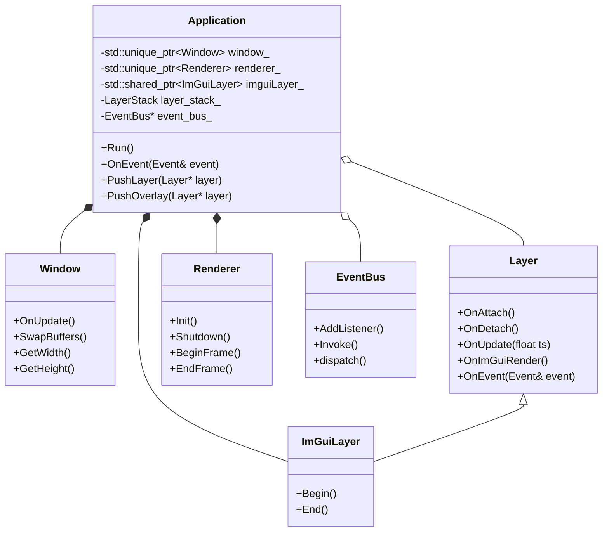
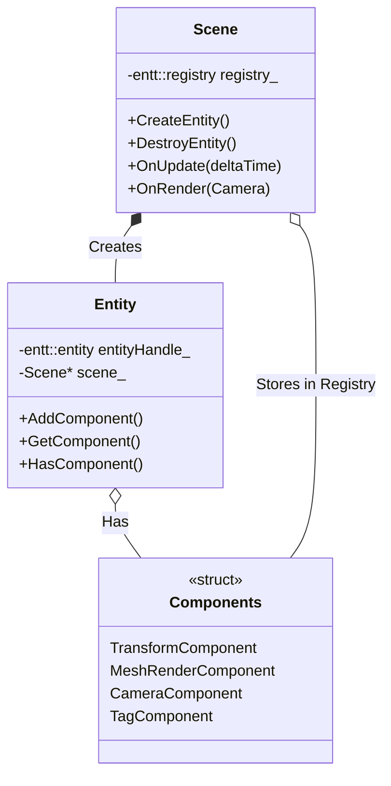
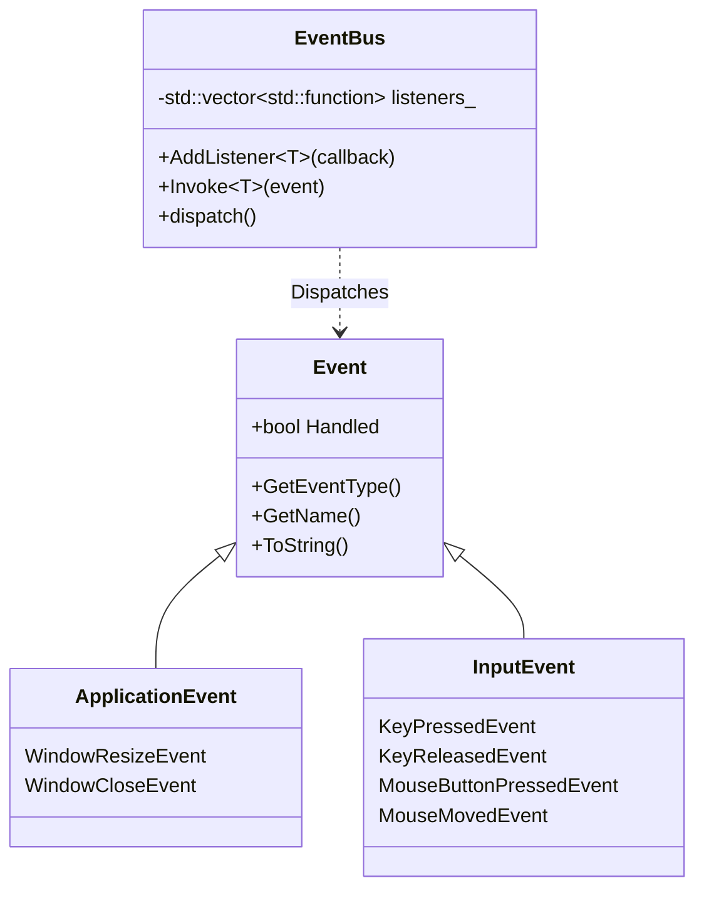
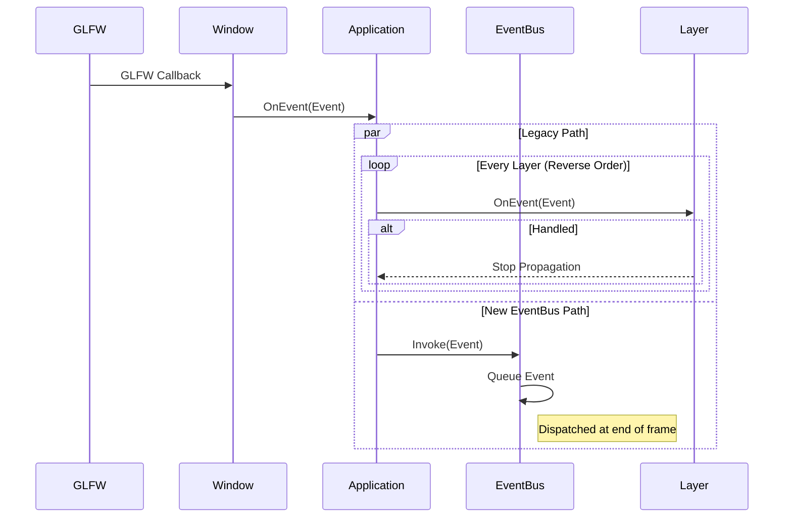
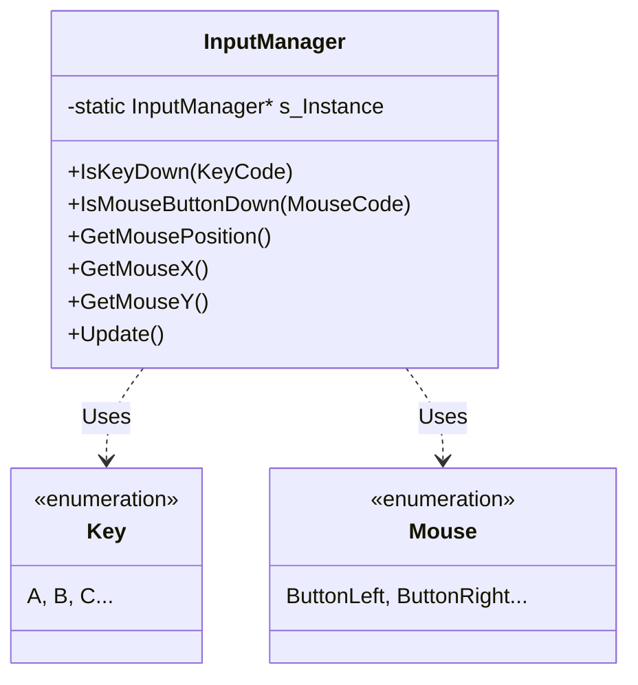

# Architecture & Diagrams

## Core Engine

### Class Diagram



### Sequence Diagram: Application Loop

```mermaid
sequenceDiagram
    participant Main
    participant App as Application
    participant Win as Window
    participant Input as InputManager
    participant Layer as LayerStack
    participant Renderer
    participant ImGui as ImGuiLayer

    Main->>App: Create()
    Main->>App: Run()
    loop Game Loop
        App->>Input: Update()
        App->>Win: OnUpdate() (Poll Events)
        
        App->>Renderer: BeginFrame()
        App->>Renderer: Clear()
        
        loop Every Layer
            App->>Layer: OnUpdate(timestep)
        end
        
        loop Every Layer
            App->>Layer: OnRender()
        end
        
        App->>Renderer: EndFrame()
        
        App->>ImGui: Begin()
        loop Every Layer
            App->>Layer: OnImGuiRender()
        end
        App->>ImGui: End()
        

## Rendering Module

### Class Diagram

```mermaid
classDiagram
    class SceneRenderer {
        +BeginScene(Camera& camera)
        +EndScene()
        +Submit(VertexArray, Material, Transform)
        -SceneData* sceneData_
    }

    class Renderer {
        +Init()
        +Shutdown()
        +BeginFrame()
        +EndFrame()
        +Clear()
    }

    class Shader {
        +Bind()
        +Unbind()
        +SetUniform()
    }

    class Material {
        +Bind()
        +SetShader(Shader)
    }

    class Mesh {
        +Draw()
    }
    
    class VertexArray {
        +Bind()
        +Unbind()
    }

    class Camera {
        +GetViewMatrix()
        +GetProjectionMatrix()
    }

    SceneRenderer ..> Renderer : Uses
    SceneRenderer ..> Camera : Uses
    SceneRenderer o-- Shader : Manages ShadowShader
    Material o-- Shader
    Mesh *-- VertexArray
```

### Sequence Diagram: Scene Rendering

```mermaid
sequenceDiagram
    participant App
    participant SceneRenderer
    participant Renderer
    participant Shader
    participant VAO as VertexArray

    App->>SceneRenderer: BeginScene(Camera)
    Note right of SceneRenderer: Setup View/Proj Matrices
    
    loop Every Entity/Mesh
        App->>SceneRenderer: Submit(VAO, Material, Transform)
        SceneRenderer->>SceneRenderer: Add to Submission Queue
    end
    
    App->>SceneRenderer: EndScene()
    
    rect rgb(50, 50, 50)
        Note right of SceneRenderer: Render Shadow Pass
        SceneRenderer->>Renderer: BeginFrame()
        SceneRenderer->>Shader: Bind(ShadowShader)
        loop Every Submission
            SceneRenderer->>VAO: Bind()
            SceneRenderer->>Renderer: DrawIndexed()
        end
    end
    
    rect rgb(60, 60, 60)
        Note right of SceneRenderer: Render Scene Pass
        loop Every Submission
            SceneRenderer->>Shader: Bind(MaterialShader)
            SceneRenderer->>Shader: SetUniforms(Light, View, Proj)
            SceneRenderer->>VAO: Bind()
            SceneRenderer->>Renderer: DrawIndexed()
        end
    end
```



## ECS Module

### Class Diagram



### Sequence Diagram: Scene Update

```mermaid
sequenceDiagram
    participant App
    participant Scene
    participant Registry as entt::registry
    participant ScriptSystem
    participant PhysicsSystem

    App->>Scene: OnUpdate(dt)
    
    rect rgb(40, 40, 60)
        Note right of Scene: Update Scripts
        Scene->>Registry: view<NativeScriptComponent>()
        loop Every Script
            Scene->>ScriptSystem: OnUpdate()
        end
    end
    
    rect rgb(40, 60, 40)
        Note right of Scene: Update Physics
        Scene->>PhysicsSystem: Simulate(dt)
        Scene->>Registry: view<Transform, Rigidbody>()
        loop Every Physics Entity
            PhysicsSystem->>Registry: Update Transform
        end
    end
```



## Event Module

### Class Diagram



### Sequence Diagram: Event Propagation



## Input Module

### Class Diagram



