# MonsterEngine Architecture

This document provides a comprehensive architectural overview of MonsterEngine, including class diagrams and sequence diagrams for all major systems.

---

## Table of Contents

1. [High-Level Architecture](#high-level-architecture)
2. [Application Layer](#application-layer)
3. [Rendering Pipeline](#rendering-pipeline)
4. [Entity Component System](#entity-component-system)
5. [Physics System](#physics-system)
6. [Animation System](#animation-system)
7. [UI System](#ui-system)
8. [Event System](#event-system)

---

## High-Level Architecture

MonsterEngine follows a **layered architecture** where the `Application` class manages a stack of `Layer` objects. Each layer can implement game logic, rendering, or tool functionality.

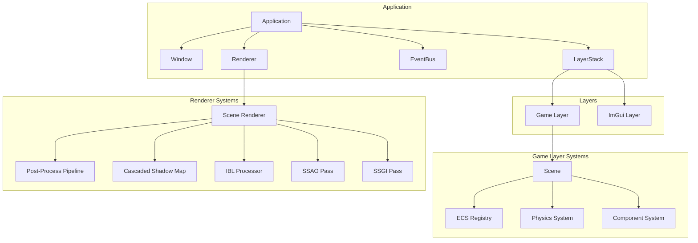
```mermaid
graph TB
    subgraph Application
        A[Application] --> W[Window]
        A --> R[Renderer]
        A --> E[EventBus]
        A --> LS[LayerStack]
    end
    
    subgraph Layers
        LS --> GL[Game Layer]
        LS --> IL[ImGui Layer]
    end
    
    subgraph Game Layer Systems
        GL --> SC[Scene]
        SC --> ECS[ECS Registry]
        SC --> PHY[Physics System]
        SC --> CS[Component System]
    end
    
    subgraph Renderer Systems
        R --> SR[Scene Renderer]
        SR --> PP[Post-Process Pipeline]
        SR --> CSM[Cascaded Shadow Map]
        SR --> IBL[IBL Processor]
        SR --> SSAO[SSAO Pass]
        SR --> SSGI[SSGI Pass]
    end
```

---

## Application Layer

### Class Diagram

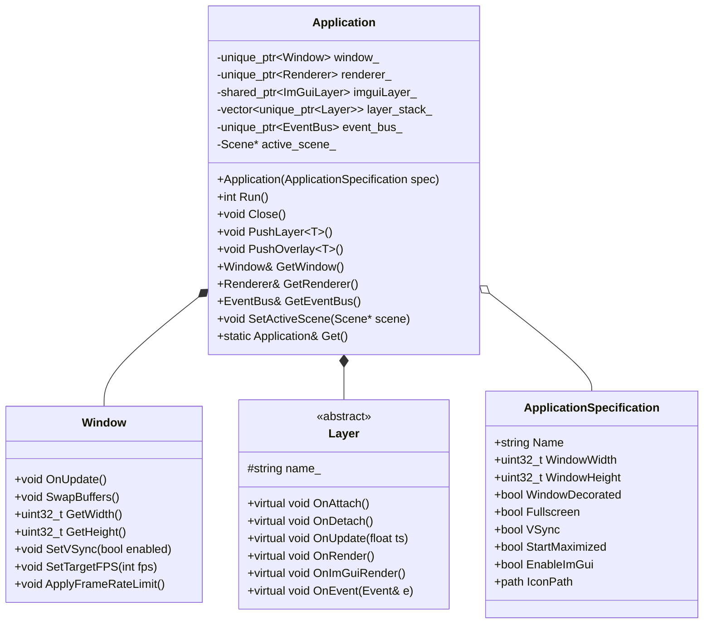
```mermaid
classDiagram
    class ApplicationSpecification {
        +string Name
        +uint32_t WindowWidth
        +uint32_t WindowHeight
        +bool WindowDecorated
        +bool Fullscreen
        +bool VSync
        +bool StartMaximized
        +bool EnableImGui
        +path IconPath
    }

    class Application {
        -unique_ptr~Window~ window_
        -unique_ptr~Renderer~ renderer_
        -shared_ptr~ImGuiLayer~ imguiLayer_
        -vector~unique_ptr~Layer~~ layer_stack_
        -unique_ptr~EventBus~ event_bus_
        -Scene* active_scene_
        +Application(ApplicationSpecification spec)
        +int Run()
        +void Close()
        +void PushLayer~T~()
        +void PushOverlay~T~()
        +Window& GetWindow()
        +Renderer& GetRenderer()
        +EventBus& GetEventBus()
        +void SetActiveScene(Scene* scene)
        +static Application& Get()
    }

    class Layer {
        <<abstract>>
        #string name_
        +virtual void OnAttach()
        +virtual void OnDetach()
        +virtual void OnUpdate(float ts)
        +virtual void OnRender()
        +virtual void OnImGuiRender()
        +virtual void OnEvent(Event& e)
    }

    class Window {
        +void OnUpdate()
        +void SwapBuffers()
        +uint32_t GetWidth()
        +uint32_t GetHeight()
        +void SetVSync(bool enabled)
        +void SetTargetFPS(int fps)
        +void ApplyFrameRateLimit()
    }

    Application *-- Window
    Application *-- Layer
    Application o-- ApplicationSpecification
```

### Application Loop Sequence

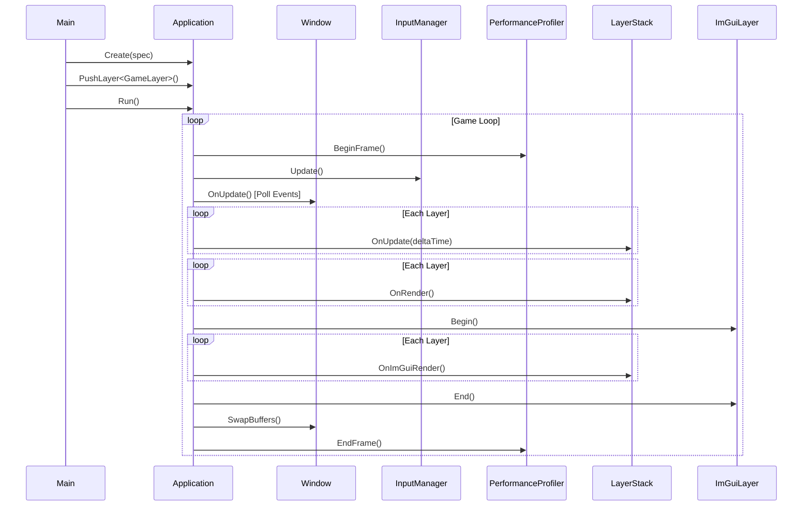
```mermaid
sequenceDiagram
    participant Main
    participant App as Application
    participant Win as Window
    participant Input as InputManager
    participant Profiler as PerformanceProfiler
    participant Layer as LayerStack
    participant ImGui as ImGuiLayer

    Main->>App: Create(spec)
    Main->>App: PushLayer<GameLayer>()
    Main->>App: Run()
    
    loop Game Loop
        App->>Profiler: BeginFrame()
        App->>Input: Update()
        App->>Win: OnUpdate() [Poll Events]
        
        loop Each Layer
            App->>Layer: OnUpdate(deltaTime)
        end
        
        loop Each Layer
            App->>Layer: OnRender()
        end
        
        App->>ImGui: Begin()
        loop Each Layer
            App->>Layer: OnImGuiRender()
        end
        App->>ImGui: End()
        
        App->>Win: SwapBuffers()
        App->>Profiler: EndFrame()
    end
```

---

## Rendering Pipeline

### Renderer Architecture

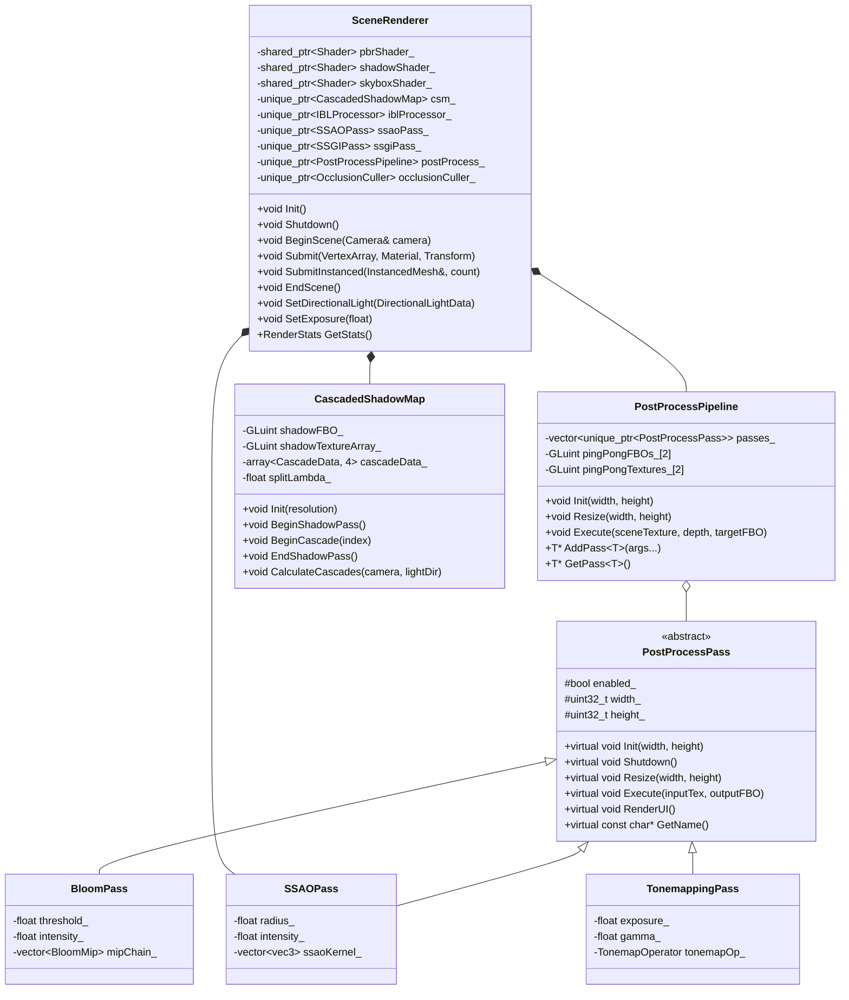
```mermaid
classDiagram
    class SceneRenderer {
        -shared_ptr~Shader~ pbrShader_
        -shared_ptr~Shader~ shadowShader_
        -shared_ptr~Shader~ skyboxShader_
        -unique_ptr~CascadedShadowMap~ csm_
        -unique_ptr~IBLProcessor~ iblProcessor_
        -unique_ptr~SSAOPass~ ssaoPass_
        -unique_ptr~SSGIPass~ ssgiPass_
        -unique_ptr~PostProcessPipeline~ postProcess_
        -unique_ptr~OcclusionCuller~ occlusionCuller_
        +void Init()
        +void Shutdown()
        +void BeginScene(Camera& camera)
        +void Submit(VertexArray, Material, Transform)
        +void SubmitInstanced(InstancedMesh&, count)
        +void EndScene()
        +void SetDirectionalLight(DirectionalLightData)
        +void SetExposure(float)
        +RenderStats GetStats()
    }

    class PostProcessPipeline {
        -vector~unique_ptr~PostProcessPass~~ passes_
        -GLuint pingPongFBOs_[2]
        -GLuint pingPongTextures_[2]
        +void Init(width, height)
        +void Resize(width, height)
        +void Execute(sceneTexture, depth, targetFBO)
        +T* AddPass~T~(args...)
        +T* GetPass~T~()
    }

    class PostProcessPass {
        <<abstract>>
        #bool enabled_
        #uint32_t width_
        #uint32_t height_
        +virtual void Init(width, height)
        +virtual void Shutdown()
        +virtual void Resize(width, height)
        +virtual void Execute(inputTex, outputFBO)
        +virtual void RenderUI()
        +virtual const char* GetName()
    }

    class BloomPass {
        -float threshold_
        -float intensity_
        -vector~BloomMip~ mipChain_
    }

    class SSAOPass {
        -float radius_
        -float intensity_
        -vector~vec3~ ssaoKernel_
    }

    class TonemappingPass {
        -float exposure_
        -float gamma_
        -TonemapOperator tonemapOp_
    }

    class CascadedShadowMap {
        -GLuint shadowFBO_
        -GLuint shadowTextureArray_
        -array~CascadeData, 4~ cascadeData_
        -float splitLambda_
        +void Init(resolution)
        +void BeginShadowPass()
        +void BeginCascade(index)
        +void EndShadowPass()
        +void CalculateCascades(camera, lightDir)
    }

    SceneRenderer *-- PostProcessPipeline
    SceneRenderer *-- CascadedShadowMap
    SceneRenderer *-- SSAOPass
    PostProcessPipeline o-- PostProcessPass
    PostProcessPass <|-- BloomPass
    PostProcessPass <|-- SSAOPass
    PostProcessPass <|-- TonemappingPass
```

### Render Frame Sequence

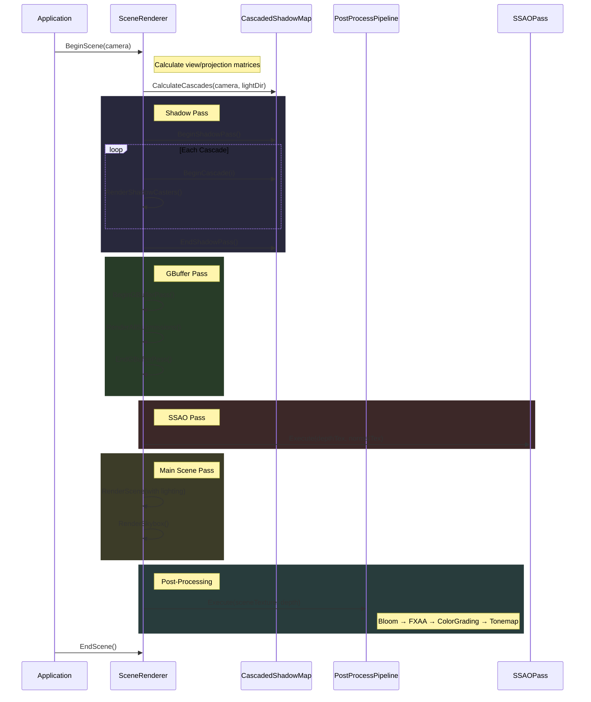
```mermaid
sequenceDiagram
    participant App as Application
    participant SR as SceneRenderer
    participant CSM as CascadedShadowMap
    participant PP as PostProcessPipeline
    participant SSAO as SSAOPass

    App->>SR: BeginScene(camera)
    Note right of SR: Calculate view/projection matrices
    
    SR->>CSM: CalculateCascades(camera, lightDir)
    
    rect rgb(40, 40, 60)
        Note right of SR: Shadow Pass
        SR->>CSM: BeginShadowPass()
        loop Each Cascade
            SR->>CSM: BeginCascade(i)
            SR->>SR: RenderShadowCasters()
        end
        SR->>CSM: EndShadowPass()
    end
    
    rect rgb(40, 60, 40)
        Note right of SR: GBuffer Pass
        SR->>SR: BeginGBufferPass()
        SR->>SR: RenderAllSubmissions()
        SR->>SR: EndGBufferPass()
    end
    
    rect rgb(60, 40, 40)
        Note right of SR: SSAO Pass
        SR->>SSAO: Execute(depthTex, normalTex)
    end
    
    rect rgb(60, 60, 40)
        Note right of SR: Main Scene Pass
        SR->>SR: RenderScene(with lighting)
        SR->>SR: RenderSkybox()
    end
    
    rect rgb(40, 60, 60)
        Note right of SR: Post-Processing
        SR->>PP: Execute(sceneTexture, depth)
        Note right of PP: Bloom → FXAA → ColorGrading → Tonemap
    end
    
    App->>SR: EndScene()
```

---

## Entity Component System

### ECS Architecture

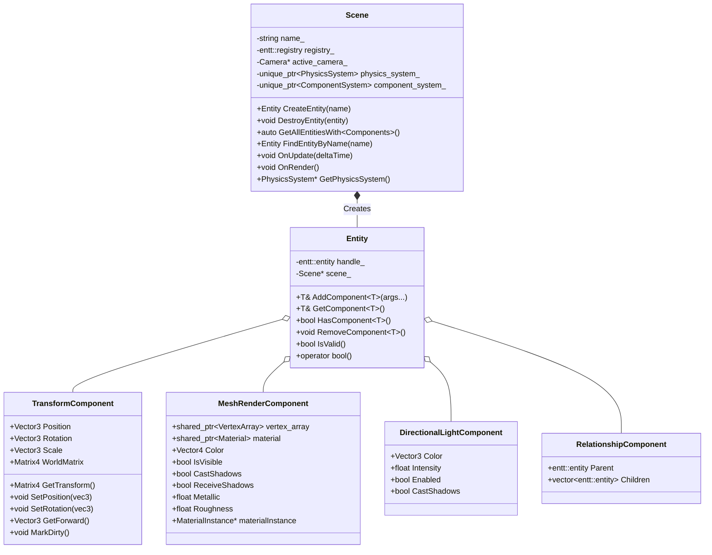
```mermaid
classDiagram
    class Scene {
        -string name_
        -entt::registry registry_
        -Camera* active_camera_
        -unique_ptr~PhysicsSystem~ physics_system_
        -unique_ptr~ComponentSystem~ component_system_
        +Entity CreateEntity(name)
        +void DestroyEntity(entity)
        +auto GetAllEntitiesWith~Components~()
        +Entity FindEntityByName(name)
        +void OnUpdate(deltaTime)
        +void OnRender()
        +PhysicsSystem* GetPhysicsSystem()
    }

    class Entity {
        -entt::entity handle_
        -Scene* scene_
        +T& AddComponent~T~(args...)
        +T& GetComponent~T~()
        +bool HasComponent~T~()
        +void RemoveComponent~T~()
        +bool IsValid()
        +operator bool()
    }

    class TransformComponent {
        +Vector3 Position
        +Vector3 Rotation
        +Vector3 Scale
        +Matrix4 WorldMatrix
        +Matrix4 GetTransform()
        +void SetPosition(vec3)
        +void SetRotation(vec3)
        +Vector3 GetForward()
        +void MarkDirty()
    }

    class MeshRenderComponent {
        +shared_ptr~VertexArray~ vertex_array
        +shared_ptr~Material~ material
        +Vector4 Color
        +bool IsVisible
        +bool CastShadows
        +bool ReceiveShadows
        +float Metallic
        +float Roughness
        +MaterialInstance* materialInstance
    }

    class DirectionalLightComponent {
        +Vector3 Color
        +float Intensity
        +bool Enabled
        +bool CastShadows
    }

    class RelationshipComponent {
        +entt::entity Parent
        +vector~entt::entity~ Children
    }

    Scene *-- Entity : Creates
    Entity o-- TransformComponent
    Entity o-- MeshRenderComponent
    Entity o-- DirectionalLightComponent
    Entity o-- RelationshipComponent
```

### Scene Update Sequence

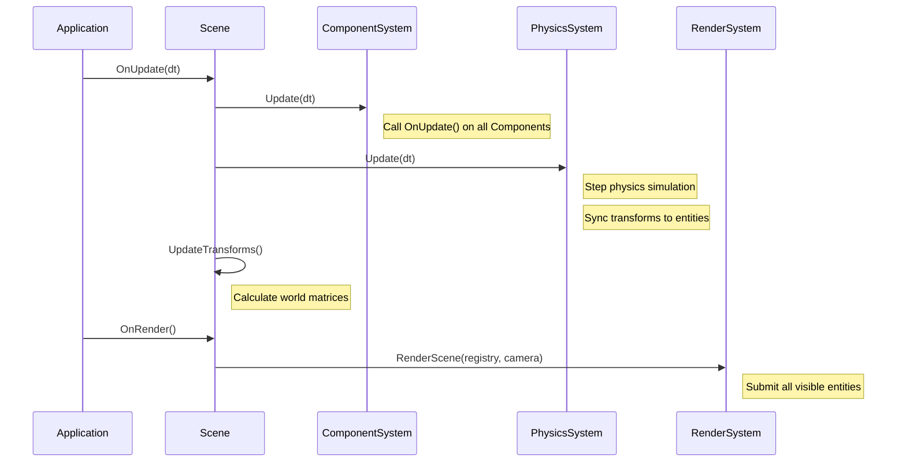
```mermaid
sequenceDiagram
    participant App as Application
    participant Scene
    participant CS as ComponentSystem
    participant PHY as PhysicsSystem
    participant RS as RenderSystem

    App->>Scene: OnUpdate(dt)
    
    Scene->>CS: Update(dt)
    Note right of CS: Call OnUpdate() on all Components
    
    Scene->>PHY: Update(dt)
    Note right of PHY: Step physics simulation
    Note right of PHY: Sync transforms to entities
    
    Scene->>Scene: UpdateTransforms()
    Note right of Scene: Calculate world matrices
    
    App->>Scene: OnRender()
    Scene->>RS: RenderScene(registry, camera)
    Note right of RS: Submit all visible entities
```

---

## Physics System

### Physics Architecture

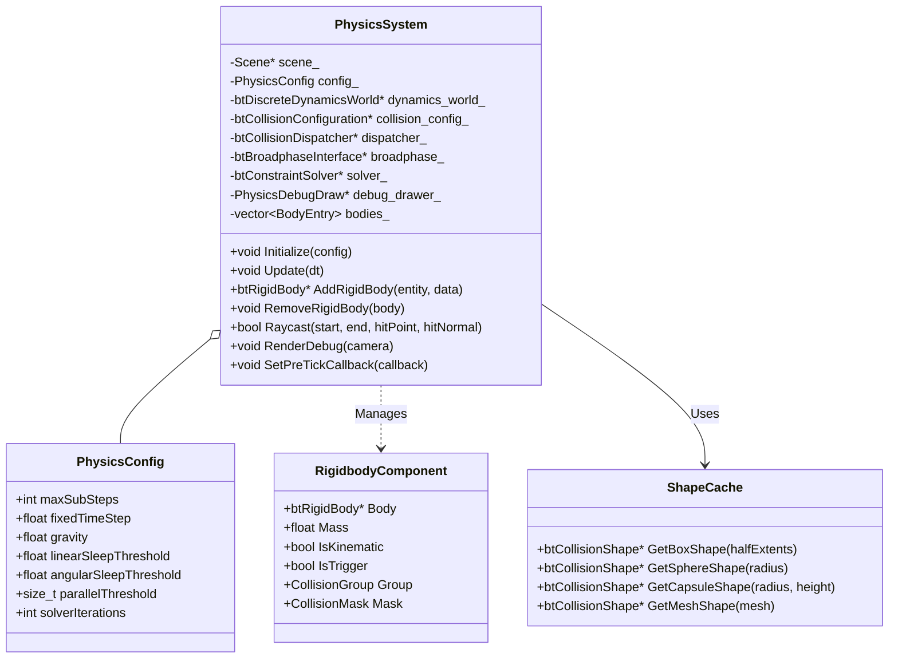
```mermaid
classDiagram
    class PhysicsConfig {
        +int maxSubSteps
        +float fixedTimeStep
        +float gravity
        +float linearSleepThreshold
        +float angularSleepThreshold
        +size_t parallelThreshold
        +int solverIterations
    }

    class PhysicsSystem {
        -Scene* scene_
        -PhysicsConfig config_
        -btDiscreteDynamicsWorld* dynamics_world_
        -btCollisionConfiguration* collision_config_
        -btCollisionDispatcher* dispatcher_
        -btBroadphaseInterface* broadphase_
        -btConstraintSolver* solver_
        -PhysicsDebugDraw* debug_drawer_
        -vector~BodyEntry~ bodies_
        +void Initialize(config)
        +void Update(dt)
        +btRigidBody* AddRigidBody(entity, data)
        +void RemoveRigidBody(body)
        +bool Raycast(start, end, hitPoint, hitNormal)
        +void RenderDebug(camera)
        +void SetPreTickCallback(callback)
    }

    class RigidbodyComponent {
        +btRigidBody* Body
        +float Mass
        +bool IsKinematic
        +bool IsTrigger
        +CollisionGroup Group
        +CollisionMask Mask
    }

    class ShapeCache {
        +btCollisionShape* GetBoxShape(halfExtents)
        +btCollisionShape* GetSphereShape(radius)
        +btCollisionShape* GetCapsuleShape(radius, height)
        +btCollisionShape* GetMeshShape(mesh)
    }

    PhysicsSystem o-- PhysicsConfig
    PhysicsSystem ..> RigidbodyComponent : Manages
    PhysicsSystem --> ShapeCache : Uses
```

---

## Animation System

### Animation Architecture

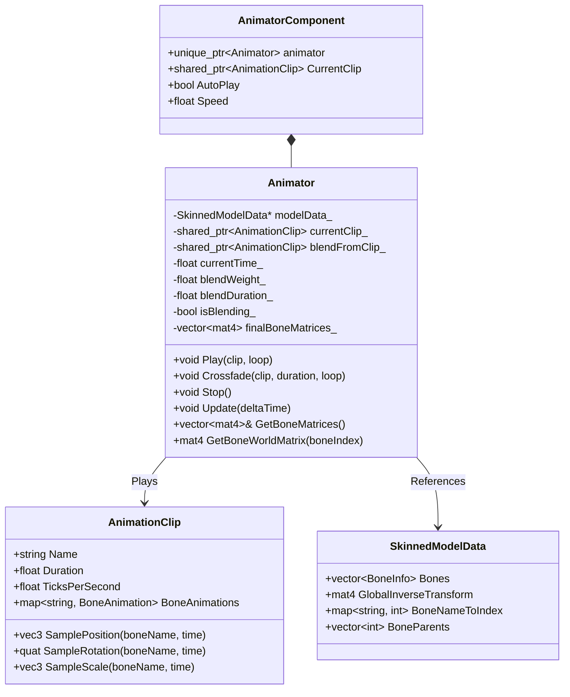
```mermaid
classDiagram
    class Animator {
        -SkinnedModelData* modelData_
        -shared_ptr~AnimationClip~ currentClip_
        -shared_ptr~AnimationClip~ blendFromClip_
        -float currentTime_
        -float blendWeight_
        -float blendDuration_
        -bool isBlending_
        -vector~mat4~ finalBoneMatrices_
        +void Play(clip, loop)
        +void Crossfade(clip, duration, loop)
        +void Stop()
        +void Update(deltaTime)
        +vector~mat4~& GetBoneMatrices()
        +mat4 GetBoneWorldMatrix(boneIndex)
    }

    class AnimationClip {
        +string Name
        +float Duration
        +float TicksPerSecond
        +map~string, BoneAnimation~ BoneAnimations
        +vec3 SamplePosition(boneName, time)
        +quat SampleRotation(boneName, time)
        +vec3 SampleScale(boneName, time)
    }

    class SkinnedModelData {
        +vector~BoneInfo~ Bones
        +mat4 GlobalInverseTransform
        +map~string, int~ BoneNameToIndex
        +vector~int~ BoneParents
    }

    class AnimatorComponent {
        +unique_ptr~Animator~ animator
        +shared_ptr~AnimationClip~ CurrentClip
        +bool AutoPlay
        +float Speed
    }

    Animator --> AnimationClip : Plays
    Animator --> SkinnedModelData : References
    AnimatorComponent *-- Animator
```

---

## UI System

### UI Architecture

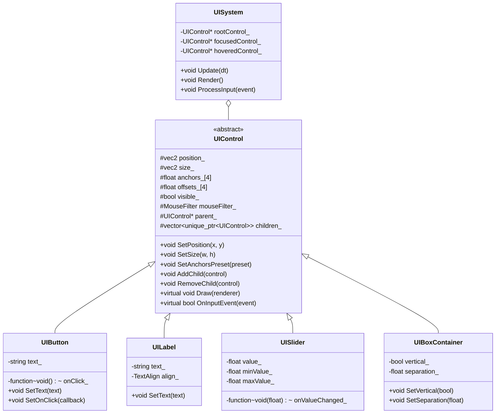
```mermaid
classDiagram
    class UIControl {
        <<abstract>>
        #vec2 position_
        #vec2 size_
        #float anchors_[4]
        #float offsets_[4]
        #bool visible_
        #MouseFilter mouseFilter_
        #UIControl* parent_
        #vector~unique_ptr~UIControl~~ children_
        +void SetPosition(x, y)
        +void SetSize(w, h)
        +void SetAnchorsPreset(preset)
        +void AddChild(control)
        +void RemoveChild(control)
        +virtual void Draw(renderer)
        +virtual bool OnInputEvent(event)
    }

    class UIButton {
        -string text_
        -function~void()~ onClick_
        +void SetText(text)
        +void SetOnClick(callback)
    }

    class UILabel {
        -string text_
        -TextAlign align_
        +void SetText(text)
    }

    class UISlider {
        -float value_
        -float minValue_
        -float maxValue_
        -function~void(float)~ onValueChanged_
    }

    class UIBoxContainer {
        -bool vertical_
        -float separation_
        +void SetVertical(bool)
        +void SetSeparation(float)
    }

    class UISystem {
        -UIControl* rootControl_
        -UIControl* focusedControl_
        -UIControl* hoveredControl_
        +void Update(dt)
        +void Render()
        +void ProcessInput(event)
    }

    UIControl <|-- UIButton
    UIControl <|-- UILabel
    UIControl <|-- UISlider
    UIControl <|-- UIBoxContainer
    UISystem o-- UIControl
```

---

## Event System

### Event Architecture

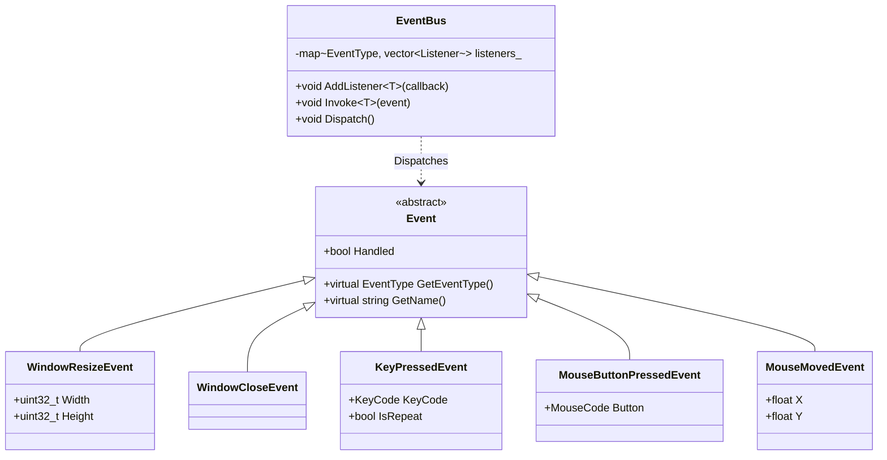
```mermaid
classDiagram
    class Event {
        <<abstract>>
        +bool Handled
        +virtual EventType GetEventType()
        +virtual string GetName()
    }

    class WindowResizeEvent {
        +uint32_t Width
        +uint32_t Height
    }

    class WindowCloseEvent {
    }

    class KeyPressedEvent {
        +KeyCode KeyCode
        +bool IsRepeat
    }

    class MouseButtonPressedEvent {
        +MouseCode Button
    }

    class MouseMovedEvent {
        +float X
        +float Y
    }

    class EventBus {
        -map~EventType, vector~Listener~~ listeners_
        +void AddListener~T~(callback)
        +void Invoke~T~(event)
        +void Dispatch()
    }

    Event <|-- WindowResizeEvent
    Event <|-- WindowCloseEvent
    Event <|-- KeyPressedEvent
    Event <|-- MouseButtonPressedEvent
    Event <|-- MouseMovedEvent
    EventBus ..> Event : Dispatches
```

### Event Flow Sequence

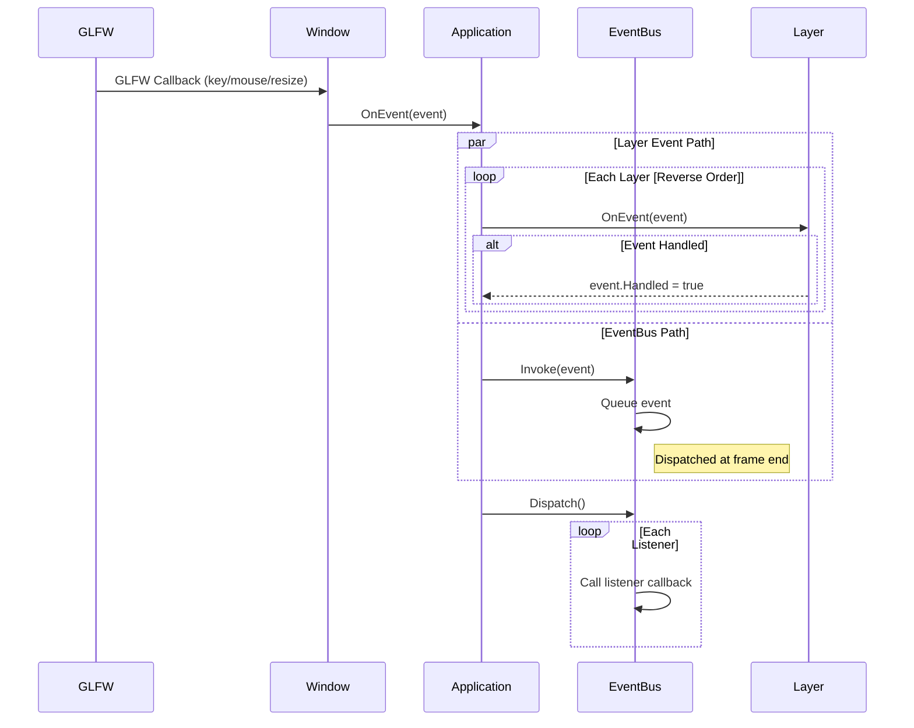
```mermaid
sequenceDiagram
    participant GLFW
    participant Window
    participant App as Application
    participant Bus as EventBus
    participant Layer

    GLFW->>Window: GLFW Callback (key/mouse/resize)
    Window->>App: OnEvent(event)
    
    par Layer Event Path
        loop Each Layer [Reverse Order]
            App->>Layer: OnEvent(event)
            alt Event Handled
                Layer-->>App: event.Handled = true
            end
        end
    and EventBus Path
        App->>Bus: Invoke(event)
        Bus->>Bus: Queue event
        Note right of Bus: Dispatched at frame end
    end
    
    App->>Bus: Dispatch()
    loop Each Listener
        Bus->>Bus: Call listener callback
    end
```

---

## Module Dependencies

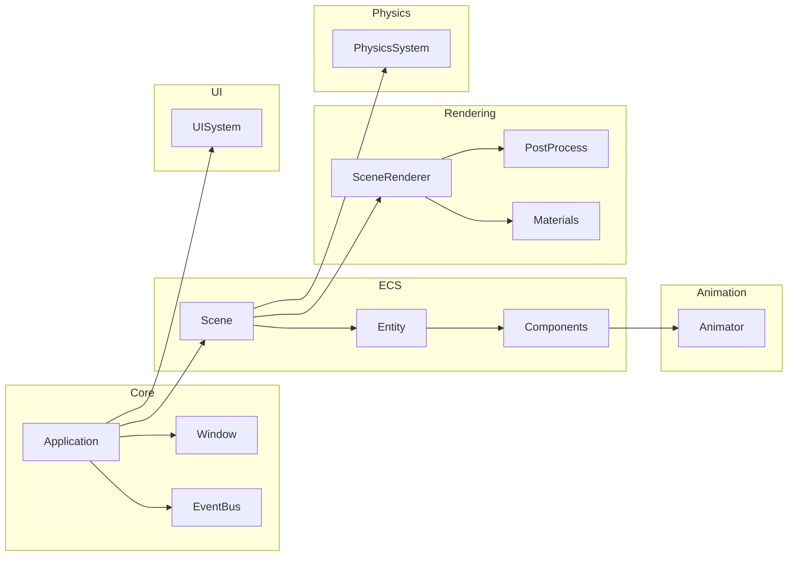
```mermaid
graph LR
    subgraph Core
        APP[Application]
        WIN[Window]
        EVT[EventBus]
    end
    
    subgraph ECS
        SCN[Scene]
        ENT[Entity]
        CMP[Components]
    end
    
    subgraph Rendering
        RND[SceneRenderer]
        PP[PostProcess]
        MAT[Materials]
    end
    
    subgraph Physics
        PHY[PhysicsSystem]
    end
    
    subgraph Animation
        ANI[Animator]
    end
    
    subgraph UI
        UIS[UISystem]
    end
    
    APP --> WIN
    APP --> EVT
    APP --> SCN
    SCN --> ENT
    ENT --> CMP
    SCN --> PHY
    SCN --> RND
    RND --> PP
    RND --> MAT
    CMP --> ANI
    APP --> UIS
```
