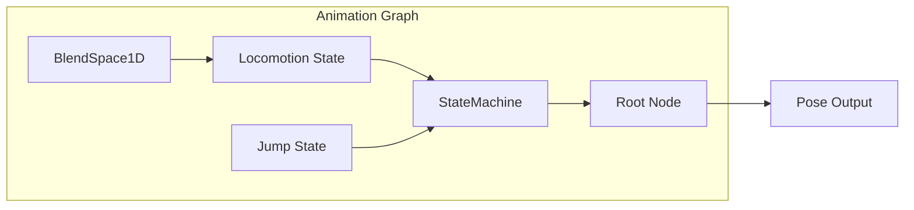

# Animation Graph

The `AnimationGraph` system provides a node-based architecture for composing complex animation behaviors.

---

## Overview

The Animation Graph replaces monolithic animation controllers with composable nodes:

- **ClipNode** - Plays a single animation clip
- **BlendNode** - Blends between two inputs
- **BlendSpaceNode** - Parameter-driven multi-animation blending
- **StateMachineNode** - State machine with conditional transitions
- **LayerNode** - Partial body animation with bone masks



---

## Creating a Graph

```cpp
#include "engine/animation/advanced/AdvancedAnimation.h"

using namespace se::anim;

// Create graph
auto graph = std::make_unique<AnimationGraph>(skeleton);

// Create nodes
auto idleNode = std::make_unique<ClipNode>(idleClip);
auto walkNode = std::make_unique<ClipNode>(walkClip);

auto blendNode = std::make_unique<BlendNode>("IdleWalk");
blendNode->SetInputA(std::move(idleNode));
blendNode->SetInputB(std::move(walkNode));
blendNode->SetBlendParameter("Speed");

graph->SetRootNode(std::move(blendNode));
```

---

## ClipNode

Plays a single animation clip:

```cpp
auto node = std::make_unique<ClipNode>(clip, true);  // true = loop

node->SetPlaybackSpeed(1.5f);
node->Reset();

float normalizedTime = node->GetNormalizedTime();
bool finished = node->HasFinished();
```

---

## BlendNode

Blends between two inputs based on weight:

```cpp
auto blend = std::make_unique<BlendNode>("Blend");
blend->SetInputA(std::move(nodeA));
blend->SetInputB(std::move(nodeB));

// Direct weight
blend->SetBlendWeight(0.5f);  // 50% A, 50% B

// Or bind to graph parameter
blend->SetBlendParameter("BlendWeight");
graph->SetFloat("BlendWeight", 0.7f);
```

---

## StateMachineNode

Hierarchical state machine with conditional transitions:

```cpp
auto stateMachine = std::make_unique<StateMachineNode>("Locomotion");

// Add states
stateMachine->AddState({"Idle", std::make_unique<ClipNode>(idleClip)});
stateMachine->AddState({"Walk", std::make_unique<ClipNode>(walkClip)});
stateMachine->AddState({"Run", std::make_unique<ClipNode>(runClip)});

stateMachine->SetDefaultState("Idle");

// Add transitions
stateMachine->AddTransition("Idle", "Walk",
    [](const AnimationGraph& g) { return g.GetFloat("Speed") > 0.5f; },
    0.2f  // Crossfade duration
);

stateMachine->AddTransition("Walk", "Run",
    [](const AnimationGraph& g) { return g.GetFloat("Speed") > 3.0f; },
    0.15f
);

stateMachine->AddTransition("Run", "Walk",
    [](const AnimationGraph& g) { return g.GetFloat("Speed") < 2.5f; },
    0.2f
);

stateMachine->AddTransition("Walk", "Idle",
    [](const AnimationGraph& g) { return g.GetFloat("Speed") < 0.3f; },
    0.25f
);
```

### State Machine Queries

```cpp
const std::string& current = stateMachine->GetCurrentState();
bool transitioning = stateMachine->IsTransitioning();
float progress = stateMachine->GetTransitionProgress();

// Manual transition
stateMachine->TransitionTo("Jump", 0.1f);
```

---

## LayerNode

Combine multiple animation sources with bone masks:

```cpp
auto layers = std::make_unique<LayerNode>("Body");

// Set base (full body)
layers->SetBaseNode(std::make_unique<ClipNode>(locomotionClip));

// Add upper body layer
LayerConfig aimLayer;
aimLayer.name = "AimOffset";
aimLayer.node = std::make_unique<ClipNode>(aimClip);
aimLayer.mask = BoneMask::UpperBody(skeleton);
aimLayer.blendMode = LayerBlendMode::Override;
aimLayer.weight = 1.0f;

size_t layerIndex = layers->AddLayer(std::move(aimLayer));

// Control layer weight
layers->SetLayerWeight("AimOffset", 0.8f);
```

### Blend Modes

| Mode | Description |
|------|-------------|
| `Override` | Replaces base animation |
| `Blend` | Interpolates with base |
| `Additive` | Adds on top of base |

---

## Parameters

The graph manages parameters for driving animation logic:

```cpp
// Set parameters
graph->SetFloat("Speed", 5.0f);
graph->SetBool("IsAiming", true);
graph->SetInt("WeaponType", 2);
graph->SetTrigger("Jump");

// Get parameters
float speed = graph->GetFloat("Speed");
bool aiming = graph->GetBool("IsAiming");
```

---

## Evaluation

```cpp
// Update timing
graph->Update(deltaTime);

// Evaluate to get pose
Pose outputPose;
outputPose.Resize(skeleton->Bones.size());
graph->Evaluate(outputPose);

// Apply to animator
animator->ApplyPose(outputPose);
```

---

## State Change Events

```cpp
graph->OnStateChanged([](const std::string& from, const std::string& to) {
    SE_LOG_INFO("State transition: {} -> {}", from, to);
});
```

---

## API Reference

### AnimationGraph

| Method | Description |
|--------|-------------|
| `SetRootNode(node)` | Set the root evaluation node |
| `Update(dt)` | Advance animation time |
| `Evaluate(pose)` | Evaluate graph and output pose |
| `SetFloat/Bool/Int(name, value)` | Set parameter |
| `GetFloat/Bool/Int(name)` | Get parameter |
| `SetTrigger(name)` | Set trigger (auto-resets) |

### ClipNode

| Method | Description |
|--------|-------------|
| `SetClip(clip)` | Set animation clip |
| `SetLoop(bool)` | Enable/disable looping |
| `SetPlaybackSpeed(float)` | Set speed multiplier |
| `Reset()` | Reset to beginning |
| `GetNormalizedTime()` | Get [0-1] progress |

### StateMachineNode

| Method | Description |
|--------|-------------|
| `AddState(state)` | Add animation state |
| `AddTransition(from, to, condition, duration)` | Add transition |
| `SetDefaultState(name)` | Set initial state |
| `TransitionTo(name, duration)` | Force transition |
| `GetCurrentState()` | Get current state name |

---

## See Also

- [Animation Overview](Overview.md)
- [Blend Spaces](BlendSpaces.md)
- [Animation Layers](Layers.md)
- [Locomotion Controller](LocomotionController.md)
