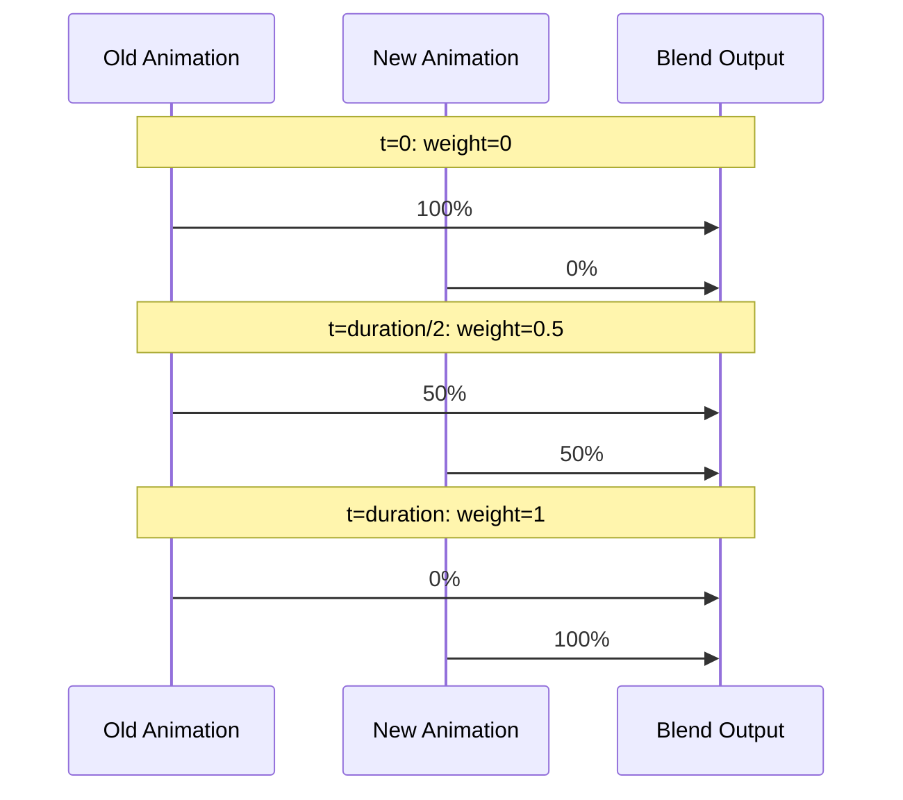

# Animator

The `Animator` class handles animation playback and crossfade blending for skeletal animations.

---

## Overview

The Animator:
- Plays `AnimationClip` data
- Calculates bone matrices each frame
- Supports crossfade blending between animations
- Provides bone world transforms for attachments

---

## Creating an Animator

```cpp
#include "engine/animation/Animator.h"

// Create with model data
const se::SkinnedModelData* modelData = skinnedModel->GetData();
se::Animator animator(modelData);

// Or use AnimatorComponent
auto& comp = entity.AddComponent<se::AnimatorComponent>();
comp.animator = std::make_unique<se::Animator>(modelData);
```

---

## Playback Control

### Play

```cpp
// Play with looping
animator.Play(idleClip, true);

// Play once
animator.Play(deathClip, false);
```

### Stop/Pause/Resume

```cpp
animator.Pause();   // Freeze current frame
animator.Resume();  // Continue from paused position
animator.Stop();    // Stop and reset
```

### Speed Control

```cpp
animator.SetSpeed(1.0f);   // Normal speed
animator.SetSpeed(2.0f);   // 2x speed
animator.SetSpeed(0.5f);   // Half speed
animator.SetSpeed(-1.0f);  // Reverse
```

### Time Control

```cpp
animator.SetTime(0.0f);   // Jump to start
animator.SetTime(1.5f);   // Jump to 1.5 seconds

float time = animator.GetCurrentTime();
```

---

## Crossfade Blending

Smoothly transition between animations:

```cpp
// Transition to run over 0.25 seconds
animator.Crossfade(runClip, 0.25f, true);

// Check blend state
if (animator.IsBlending()) {
    float weight = animator.GetBlendWeight();
    // weight goes from 0 (old) to 1 (new)
}
```

### How Crossfade Works



---

## Update

Call each frame:

```cpp
animator.Update(deltaTime);
```

This:
1. Advances animation time
2. Samples keyframes
3. Calculates bone local transforms
4. Computes bone hierarchy
5. Updates blend weights if crossfading

---

## Accessing Bone Matrices

### All Bone Matrices

```cpp
const std::vector<glm::mat4>& bones = animator.GetBoneMatrices();

// Upload to GPU
shader->Bind();
for (size_t i = 0; i < bones.size(); i++) {
    std::string name = "uBoneMatrices[" + std::to_string(i) + "]";
    shader->SetMat4(name.c_str(), bones[i]);
}
```

### Specific Bone

```cpp
// By index
glm::mat4 handMatrix = animator.GetBoneWorldMatrix(25);

// By name
glm::mat4 headMatrix = animator.GetBoneWorldMatrix("Head");
```

---

## State Queries

```cpp
bool playing = animator.IsPlaying();
bool looping = animator.IsLooping();
bool blending = animator.IsBlending();

float time = animator.GetCurrentTime();
float speed = animator.GetSpeed();
float blendWeight = animator.GetBlendWeight();

auto clip = animator.GetCurrentClip();
```

---

## Example: Character Controller

```cpp
class CharacterAnimator {
public:
    void Update(float dt, const CharacterState& state) {
        if (state.isRunning && currentState_ != State::Running) {
            animator_->Crossfade(runClip_, 0.15f, true);
            currentState_ = State::Running;
        }
        else if (state.isIdle && currentState_ != State::Idle) {
            animator_->Crossfade(idleClip_, 0.2f, true);
            currentState_ = State::Idle;
        }
        else if (state.isJumping && currentState_ != State::Jumping) {
            animator_->Crossfade(jumpClip_, 0.1f, false);
            currentState_ = State::Jumping;
        }
        
        // Check for jump animation end
        if (currentState_ == State::Jumping && !animator_->IsPlaying()) {
            animator_->Crossfade(idleClip_, 0.15f, true);
            currentState_ = State::Idle;
        }
        
        animator_->Update(dt);
    }
    
private:
    se::Animator* animator_;
    std::shared_ptr<se::AnimationClip> idleClip_;
    std::shared_ptr<se::AnimationClip> runClip_;
    std::shared_ptr<se::AnimationClip> jumpClip_;
    
    enum class State { Idle, Running, Jumping };
    State currentState_ = State::Idle;
};
```

---

## API Reference

### Constructor

```cpp
Animator();
explicit Animator(const SkinnedModelData* modelData);
```

### Playback

| Method | Description |
|--------|-------------|
| `Play(clip, loop)` | Immediately play animation |
| `Crossfade(clip, duration, loop)` | Smooth transition to animation |
| `Stop()` | Stop playback, reset time |
| `Pause()` | Freeze at current frame |
| `Resume()` | Continue from paused state |

### Configuration

| Method | Description |
|--------|-------------|
| `SetSpeed(float)` | Set playback speed |
| `SetTime(float)` | Jump to specific time |
| `SetModelData(data)` | Change model data |

### Getters

| Method | Return Type | Description |
|--------|-------------|-------------|
| `GetBoneMatrices()` | `vector<mat4>&` | All bone matrices |
| `GetBoneWorldMatrix(int)` | `mat4` | Bone matrix by index |
| `GetBoneWorldMatrix(string)` | `mat4` | Bone matrix by name |
| `GetCurrentTime()` | `float` | Current animation time |
| `GetSpeed()` | `float` | Playback speed |
| `GetBlendWeight()` | `float` | Crossfade progress [0-1] |
| `GetCurrentClip()` | `shared_ptr<AnimationClip>` | Active clip |
| `GetModelData()` | `SkinnedModelData*` | Model reference |

### State Queries

| Method | Description |
|--------|-------------|
| `IsPlaying()` | Is animation playing |
| `IsLooping()` | Is current clip looping |
| `IsBlending()` | Is crossfade in progress |

---

## See Also

- [Animation Overview](Overview.md)
- [AnimationClip](AnimationClip.md)
- [BoneAttachments](BoneAttachments.md)
