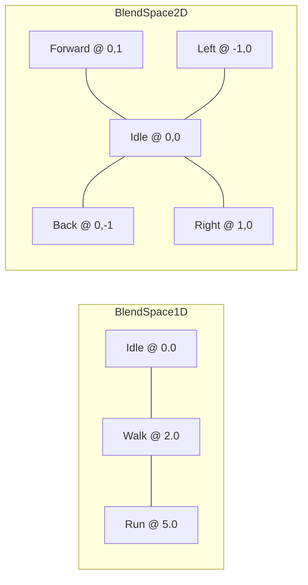

# Blend Spaces

Blend spaces interpolate between multiple animations based on one or two parameters.

---

## Overview

| Class | Axes | Use Case |
|-------|------|----------|
| `BlendSpace1D` | 1 | Velocity (idle→walk→run) |
| `BlendSpace2D` | 2 | Strafe, aim offset |



---

## BlendSpace1D

### Setup

```cpp
#include "engine/animation/advanced/BlendSpace.h"

auto blendSpace = std::make_unique<BlendSpace1D>("Locomotion");
blendSpace->SetBounds(0.0f, 8.0f);  // Min and max parameter

// Add samples at specific positions
blendSpace->AddSample(idleClip, 0.0f);   // Idle at velocity 0
blendSpace->AddSample(walkClip, 2.0f);   // Walk at velocity 2
blendSpace->AddSample(runClip, 5.0f);    // Run at velocity 5
```

### Evaluation

```cpp
float velocity = 3.5f;  // Between walk and run
float time = animationTime;

Pose outputPose;
outputPose.Resize(skeleton->Bones.size());

blendSpace->Evaluate(velocity, outputPose, time, skeleton);
```

### How It Works

When velocity = 3.5 (between walk@2.0 and run@5.0):
- Walk weight = (5.0 - 3.5) / (5.0 - 2.0) = 0.5
- Run weight = (3.5 - 2.0) / (5.0 - 2.0) = 0.5
- Result: 50% walk + 50% run

---

## BlendSpace2D

### Setup

```cpp
auto blendSpace = std::make_unique<BlendSpace2D>("Strafe");
blendSpace->SetBounds(glm::vec2(-1.0f), glm::vec2(1.0f));

// Center (idle)
blendSpace->AddSample(strafeIdle, glm::vec2(0.0f, 0.0f));

// Cardinal directions
blendSpace->AddSample(strafeForward, glm::vec2(0.0f, 1.0f));
blendSpace->AddSample(strafeBack, glm::vec2(0.0f, -1.0f));
blendSpace->AddSample(strafeLeft, glm::vec2(-1.0f, 0.0f));
blendSpace->AddSample(strafeRight, glm::vec2(1.0f, 0.0f));

// Diagonals (optional, improves quality)
blendSpace->AddSample(strafeFwdLeft, glm::vec2(-0.7f, 0.7f));
blendSpace->AddSample(strafeFwdRight, glm::vec2(0.7f, 0.7f));
blendSpace->AddSample(strafeBackLeft, glm::vec2(-0.7f, -0.7f));
blendSpace->AddSample(strafeBackRight, glm::vec2(0.7f, -0.7f));
```

### Evaluation

```cpp
glm::vec2 inputDir = GetNormalizedInputDirection();  // From WASD
float time = animationTime;

Pose outputPose;
blendSpace->Evaluate(inputDir, outputPose, time, skeleton);
```

### Delaunay Triangulation

BlendSpace2D automatically builds Delaunay triangulation for smooth interpolation:

```
    Forward (0,1)
       /\
      /  \
     /    \
Left(-1,0)--Idle(0,0)--Right(1,0)
     \    /
      \  /
       \/
    Back (0,-1)
```

---

## Graph Node Wrappers

Use blend spaces within AnimationGraph:

### BlendSpace1DNode

```cpp
auto node = std::make_unique<BlendSpace1DNode>("Locomotion");
node->SetBlendSpace(std::move(blendSpace));

// Direct parameter
node->SetParameter(velocity);

// Or bind to graph parameter
node->SetParameterBinding("Speed");
graph->SetFloat("Speed", 4.0f);
```

### BlendSpace2DNode

```cpp
auto node = std::make_unique<BlendSpace2DNode>("Strafe");
node->SetBlendSpace(std::move(blendSpace));

// Bind X and Y separately
node->SetParameterBindingX("StrafeX");
node->SetParameterBindingY("StrafeY");

graph->SetFloat("StrafeX", inputDir.x);
graph->SetFloat("StrafeY", inputDir.y);
```

---

## API Reference

### BlendSpace1D

| Method | Description |
|--------|-------------|
| `SetBounds(min, max)` | Set parameter range |
| `AddSample(clip, position)` | Add animation sample |
| `Evaluate(param, pose, time, skeleton)` | Evaluate at parameter |
| `GetSampleCount()` | Number of samples |

### BlendSpace2D

| Method | Description |
|--------|-------------|
| `SetBounds(min, max)` | Set 2D bounds |
| `AddSample(clip, position)` | Add animation sample |
| `Evaluate(param, pose, time, skeleton)` | Evaluate at 2D position |
| `GetSampleCount()` | Number of samples |

---

## See Also

- [Animation Overview](Overview.md)
- [Locomotion Controller](LocomotionController.md)
- [Animation Graph](AnimationGraph.md)
