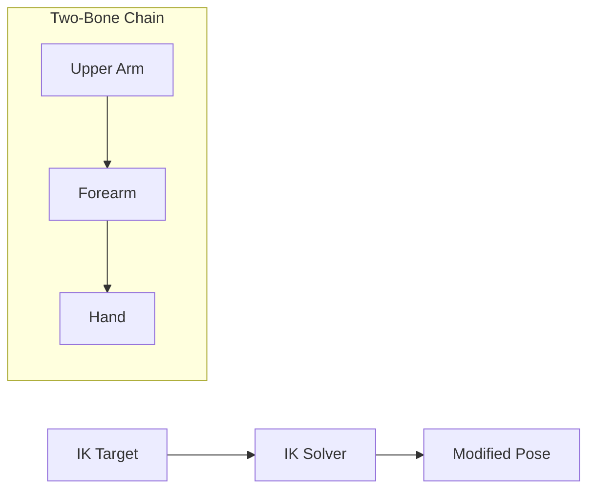

# IK System

Inverse Kinematics (IK) solvers for procedural limb positioning.

---

## Overview

The IK system provides:
- **IIKSolver** - Base interface for all IK solvers
- **TwoBoneIKSolver** - Analytical solver for arms/legs



---

## TwoBoneIKSolver

Solves IK for limbs with two bones (arm, leg). Uses analytical solution with pole vector for elbow/knee direction.

### Configuration

```cpp
#include "engine/animation/ik/TwoBoneIKSolver.h"

using namespace se::anim;

TwoBoneIKConfig config;
config.rootBoneName = "upperarm_l";    // Shoulder
config.midBoneName = "lowerarm_l";     // Elbow
config.endBoneName = "hand_l";         // Hand
config.poleVector = glm::vec3(0, 0, -1);  // Elbow bends backward
config.maxStretch = 1.0f;              // No stretching

auto solver = std::make_unique<TwoBoneIKSolver>(config);
solver->Initialize(skeleton);
```

### Usage

```cpp
// Create target
IKTarget target;
target.position = weaponForeGripPosition;
target.weight = 1.0f;

// Optional: control end effector rotation
target.rotation = desiredHandRotation;
target.useRotation = true;

// Solve IK
solver->Solve(pose, target);
```

### Pole Vector

The pole vector controls which direction the mid bone (elbow/knee) bends:

| Pole Vector | Effect |
|-------------|--------|
| `(0, 0, -1)` | Elbow bends backward |
| `(0, 0, 1)` | Elbow bends forward |
| `(0, -1, 0)` | Elbow bends down |

```cpp
// Dynamically adjust pole based on aim direction
solver->SetPoleVector(glm::vec3(0, 0, -1) + aimOffset);
```

---

## IK Target

```cpp
struct IKTarget {
    glm::vec3 position{0.0f};              // World position
    glm::quat rotation{1, 0, 0, 0};        // End rotation
    float weight = 1.0f;                    // Blend weight [0-1]
    bool useRotation = false;               // Apply rotation
};
```

### Weight Blending

```cpp
// Smooth IK activation
float ikWeight = SmoothStep(0.0f, 0.3f, aimTime);

IKTarget target;
target.position = gripPosition;
target.weight = ikWeight;  // 0 = animation only, 1 = full IK

solver->Solve(pose, target);
```

---

## Custom IK Solver

Implement the interface for custom algorithms:

```cpp
class MyIKSolver : public IIKSolver {
public:
    void Initialize(const SkinnedModelData* skeleton) override {
        // Setup bone indices
    }
    
    void Solve(Pose& pose, const IKTarget& target) override {
        if (!enabled_ || target.weight < 0.001f) return;
        // Custom IK algorithm
    }
    
    std::string GetName() const override { return "MyIK"; }
};
```

---

## Integration with AdvancedAnimatorComponent

```cpp
AdvancedAnimatorComponent animator;

// Add IK solver
TwoBoneIKConfig leftArmIK;
leftArmIK.rootBoneName = "upperarm_l";
leftArmIK.midBoneName = "lowerarm_l";
leftArmIK.endBoneName = "hand_l";

animator.AddIKSolver(std::make_unique<TwoBoneIKSolver>(leftArmIK));

// Access later
auto* ik = animator.GetIKSolver("TwoBoneIK");
```

---

## API Reference

### IIKSolver

| Method | Description |
|--------|-------------|
| `Initialize(skeleton)` | Setup with skeleton |
| `Solve(pose, target)` | Apply IK to pose |
| `GetName()` | Solver name |
| `SetEnabled(bool)` | Enable/disable |
| `IsEnabled()` | Check enabled |

### TwoBoneIKSolver

| Method | Description |
|--------|-------------|
| `SetConfig(config)` | Set bone config |
| `SetPoleVector(vec3)` | Set bend direction |
| `DidSolve()` | Whether IK was applied |
| `GetReachRatio()` | Distance/chain length |

---

## Example: Weapon Grip IK

```cpp
class WeaponIK : public se::Component {
    std::unique_ptr<TwoBoneIKSolver> leftHandIK_;
    Entity weapon_;
    
    void Start() override {
        TwoBoneIKConfig config;
        config.rootBoneName = "upperarm_l";
        config.midBoneName = "lowerarm_l";
        config.endBoneName = "hand_l";
        config.poleVector = glm::vec3(0, 0, -1);
        
        leftHandIK_ = std::make_unique<TwoBoneIKSolver>(config);
        leftHandIK_->Initialize(GetSkeleton());
    }
    
    void LateUpdate(float dt) override {
        if (!IsAiming()) {
            leftHandIK_->SetEnabled(false);
            return;
        }
        
        leftHandIK_->SetEnabled(true);
        
        // Get foregrip world position from weapon
        glm::vec3 foreGripPos = weapon_.GetComponent<WeaponComponent>()
            .GetForeGripWorldPosition();
        
        IKTarget target;
        target.position = foreGripPos;
        target.weight = 1.0f;
        
        Pose& pose = GetAnimator().GetFinalPose();
        leftHandIK_->Solve(pose, target);
    }
};
```

---

## See Also

- [Animation Overview](Overview.md)
- [Bone Attachment](BoneAttachment.md)
- [Procedural Animation](ProceduralAnimation.md)
