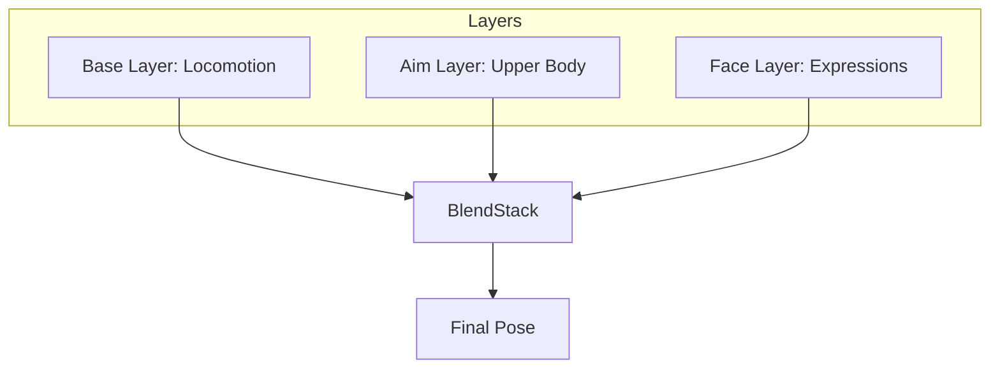

# Animation Layers

Layer-based animation blending for combining multiple animation sources.

---

## Overview

Animation layers allow:
- Partial body animation (upper/lower body)
- Overlays (weapon poses, facial animation)
- Blend modes (override, additive, blend)



---

## AnimationLayerStack

The runtime layer blending system:

```cpp
#include "engine/animation/advanced/AnimationLayer.h"

AnimationLayerStack layers;

// Add layers
layers.AddLayer("BaseLocomotion", LayerBlendMode::Override, BoneMask::FullBody());
layers.AddLayer("UpperBodyAim", LayerBlendMode::Override, BoneMask::UpperBody(skeleton));
layers.AddLayer("FaceExpressions", LayerBlendMode::Blend, BoneMask::Head(skeleton));

// Set layer poses
layers.SetLayerPose("BaseLocomotion", locomotionPose);
layers.SetLayerPose("UpperBodyAim", aimPose);
layers.SetLayerPose("FaceExpressions", expressionPose);

// Evaluate
Pose finalPose;
layers.Evaluate(finalPose);
```

---

## LayerNode (Graph)

Use layers within AnimationGraph:

```cpp
auto layerNode = std::make_unique<LayerNode>("Body");

// Base layer (full body locomotion)
layerNode->SetBaseNode(std::make_unique<ClipNode>(locomotionClip));

// Add upper body aim overlay
LayerConfig aimLayer;
aimLayer.name = "Aim";
aimLayer.node = std::make_unique<ClipNode>(aimClip);
aimLayer.mask = BoneMask::UpperBody(skeleton);
aimLayer.blendMode = LayerBlendMode::Override;
aimLayer.weight = 1.0f;

layerNode->AddLayer(std::move(aimLayer));

// Control weight dynamically
layerNode->SetLayerWeight("Aim", isAiming ? 1.0f : 0.0f);
```

---

## BoneMask

Defines which bones are affected by a layer:

### Preset Masks

```cpp
BoneMask fullBody = BoneMask::FullBody();
BoneMask upper = BoneMask::UpperBody(skeleton);    // Spine and up
BoneMask lower = BoneMask::LowerBody(skeleton);    // Pelvis and down
BoneMask spine = BoneMask::SpineChain(skeleton);   // Spine only
BoneMask leftArm = BoneMask::LeftArm(skeleton);    // Left arm
BoneMask rightArm = BoneMask::RightArm(skeleton);  // Right arm
```

### Custom Masks

```cpp
BoneMask custom;
custom.AddBone(skeleton->GetBoneIndex("spine_01"));
custom.AddBone(skeleton->GetBoneIndex("spine_02"));
custom.AddBone(skeleton->GetBoneIndex("spine_03"));

// With soft weights
custom.SetWeight(skeleton->GetBoneIndex("spine_01"), 0.3f);
custom.SetWeight(skeleton->GetBoneIndex("spine_02"), 0.6f);
custom.SetWeight(skeleton->GetBoneIndex("spine_03"), 1.0f);
```

### Mask Queries

```cpp
bool includes = mask.Contains(boneIndex);
float weight = mask.GetWeight(boneIndex);
```

---

## Blend Modes

| Mode | Description | Use Case |
|------|-------------|----------|
| `Override` | Replaces base pose | Aim poses |
| `Blend` | Interpolates with base | Facial blend shapes |
| `Additive` | Adds delta to base | Breathing, recoil |

### Override

```cpp
// Upper body completely takes aim pose
LayerConfig aimLayer;
aimLayer.blendMode = LayerBlendMode::Override;
aimLayer.weight = 1.0f;  // 100% override
```

### Blend

```cpp
// Blend face expression with animation
LayerConfig faceLayer;
faceLayer.blendMode = LayerBlendMode::Blend;
faceLayer.weight = 0.5f;  // 50/50 mix
```

### Additive

```cpp
// Add breathing motion on top of everything
LayerConfig breatheLayer;
breatheLayer.blendMode = LayerBlendMode::Additive;
breatheLayer.weight = 0.3f;  // Subtle additive
```

---

## Weight Control

### Static Weight

```cpp
aimLayer.weight = 1.0f;
```

### Parameter Binding

```cpp
aimLayer.weightParameter = "AimWeight";
graph->SetFloat("AimWeight", 0.8f);
```

### Dynamic Weight

```cpp
// Smooth weight transition
float targetWeight = isAiming ? 1.0f : 0.0f;
currentWeight = glm::mix(currentWeight, targetWeight, dt * 5.0f);
layerNode->SetLayerWeight("Aim", currentWeight);
```

---

## API Reference

### AnimationLayerStack

| Method | Description |
|--------|-------------|
| `AddLayer(name, mode, mask)` | Add layer |
| `RemoveLayer(name)` | Remove layer |
| `SetLayerPose(name, pose)` | Set layer pose |
| `SetLayerWeight(name, weight)` | Set weight |
| `Evaluate(outPose)` | Blend all layers |
| `GetLayerCount()` | Number of layers |

### LayerNode

| Method | Description |
|--------|-------------|
| `SetBaseNode(node)` | Set base animation |
| `AddLayer(config)` | Add overlay layer |
| `RemoveLayer(name)` | Remove layer |
| `SetLayerWeight(name, weight)` | Set weight |
| `GetLayerCount()` | Number of layers |

### BoneMask

| Method | Description |
|--------|-------------|
| `FullBody()` | All bones |
| `UpperBody(skeleton)` | Spine and above |
| `LowerBody(skeleton)` | Pelvis and below |
| `SpineChain(skeleton)` | Spine only |
| `AddBone(index)` | Add bone |
| `Contains(index)` | Check inclusion |
| `GetWeight(index)` | Get bone weight |

---

## Example: Full Character Setup

```cpp
class CharacterLayers : public se::Component {
    AnimationLayerStack layers_;
    
    void Start() override {
        auto* skeleton = GetSkeleton();
        
        layers_.AddLayer("Base", LayerBlendMode::Override, BoneMask::FullBody());
        layers_.AddLayer("Aim", LayerBlendMode::Override, BoneMask::UpperBody(skeleton));
        layers_.AddLayer("Reload", LayerBlendMode::Override, BoneMask::UpperBody(skeleton));
        
        layers_.SetLayerWeight("Reload", 0.0f);  // Off by default
    }
    
    void Update(float dt) override {
        // Update layer poses
        layers_.SetLayerPose("Base", locomotionPose_);
        layers_.SetLayerPose("Aim", aimPose_);
        
        if (isReloading_) {
            layers_.SetLayerPose("Reload", reloadPose_);
            layers_.SetLayerWeight("Reload", 1.0f);
        } else {
            layers_.SetLayerWeight("Reload", 0.0f);
        }
        
        // Evaluate final pose
        Pose finalPose;
        layers_.Evaluate(finalPose);
        animator_->ApplyPose(finalPose);
    }
};
```

---

## See Also

- [Animation Overview](Overview.md)
- [Animation Graph](AnimationGraph.md)
- [Blend Spaces](BlendSpaces.md)
