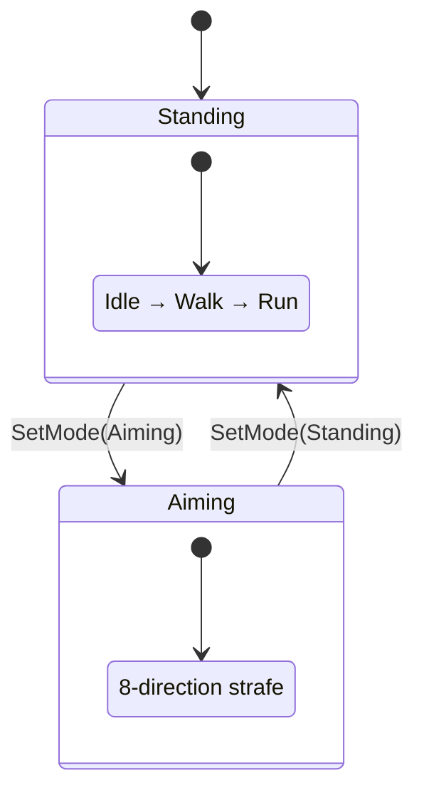

# Locomotion Controller

The `LocomotionController` manages character locomotion animation with blend spaces for smooth velocity and directional blending.

---

## Overview

The LocomotionController:
- Manages locomotion modes (Standing, Aiming, Swimming)
- Uses BlendSpace1D for velocity-based animation (idle → walk → run)
- Uses BlendSpace2D for directional strafing
- Provides smooth transitions between modes



---

## Configuration

```cpp
#include "engine/animation/locomotion/LocomotionController.h"

using namespace se::anim;

LocomotionConfig config;

// Animation paths
config.animations.idle = "assets/anims/idle.fbx";
config.animations.walk = "assets/anims/walk.fbx";
config.animations.run = "assets/anims/run.fbx";

// Strafe animations (for aim mode)
config.animations.strafeIdle = "assets/anims/strafe_idle.fbx";
config.animations.strafeForward = "assets/anims/strafe_forward.fbx";
config.animations.strafeBack = "assets/anims/strafe_back.fbx";
config.animations.strafeLeft = "assets/anims/strafe_left.fbx";
config.animations.strafeRight = "assets/anims/strafe_right.fbx";

// Blend thresholds
config.idleThreshold = 0.1f;   // Below = idle
config.walkThreshold = 2.0f;   // Walk speed
config.runThreshold = 5.0f;    // Run speed
config.maxSpeed = 8.0f;        // Max blend space bound

// Transition settings
config.crossfadeDuration = 0.15f;
config.modeTransitionDuration = 0.3f;
config.velocityLerpSpeed = 10.0f;
```

---

## Initialization

```cpp
const SkinnedModelData* skeleton = model->GetData();

LocomotionController locomotion;
locomotion.Initialize(config, skeleton);

if (!locomotion.IsInitialized()) {
    SE_LOG_ERROR("Failed to initialize locomotion");
}
```

---

## Update Loop

```cpp
void Update(float dt) {
    // Get character velocity
    float speed = glm::length(characterVelocity);
    
    // Set locomotion parameters
    locomotion.SetVelocity(speed);
    
    // In aiming mode, also set strafe input
    if (locomotion.GetMode() == LocomotionMode::Aiming) {
        glm::vec2 strafeInput = GetStrafeInput();  // [-1, 1] range
        locomotion.SetStrafeInput(strafeInput);
    }
    
    // Update and get pose
    Pose outputPose;
    outputPose.Resize(skeleton->Bones.size());
    locomotion.Update(dt, outputPose);
    
    // Apply to animator
    animator->ApplyPose(outputPose);
}
```

---

## Locomotion Modes

### Standing Mode

Normal movement with full body rotation toward movement direction:

```cpp
locomotion.SetMode(LocomotionMode::Standing);
locomotion.SetVelocity(characterSpeed);
```

### Aiming Mode

Strafe movement with body locked to aim direction:

```cpp
locomotion.SetMode(LocomotionMode::Aiming);
locomotion.SetStrafeInput(inputDir);  // From WASD: x=left/right, y=forward/back
```

### Mode Transitions

```cpp
// Check transition state
if (locomotion.IsInTransition()) {
    // Currently blending between modes
}

// Listen for mode changes
locomotion.OnModeChanged([](LocomotionMode old, LocomotionMode now) {
    SE_LOG_INFO("Mode changed: {} -> {}", (int)old, (int)now);
});
```

---

## Blend Space Access

Access blend spaces directly for debug visualization:

```cpp
BlendSpace1D* locomotionBS = locomotion.GetLocomotionBlendSpace();
BlendSpace2D* strafeBS = locomotion.GetStrafeBlendSpace();

// Get current blend weights for debug display
auto weights = locomotionBS->GetBlendWeights(currentVelocity);
```

---

## API Reference

### Constructor

```cpp
LocomotionController();
```

### Initialization

| Method | Description |
|--------|-------------|
| `Initialize(config, skeleton)` | Initialize with config and skeleton |
| `IsInitialized()` | Check if initialized |

### Mode Control

| Method | Description |
|--------|-------------|
| `SetMode(mode)` | Set locomotion mode |
| `GetMode()` | Get current mode |
| `IsInTransition()` | Check if transitioning |

### Input

| Method | Description |
|--------|-------------|
| `SetVelocity(speed)` | Set movement speed |
| `GetVelocity()` | Get smoothed velocity |
| `SetStrafeInput(vec2)` | Set strafe direction |
| `GetStrafeInput()` | Get strafe input |

### Update

| Method | Description |
|--------|-------------|
| `Update(dt, pose)` | Update and output pose |
| `OnModeChanged(callback)` | Mode change callback |

### Blend Space Access

| Method | Description |
|--------|-------------|
| `GetLocomotionBlendSpace()` | Get 1D blend space |
| `GetStrafeBlendSpace()` | Get 2D blend space |
| `GetConfig()` | Get configuration |

---

## Example: Third-Person Character

```cpp
class CharacterAnimator : public se::Component {
    se::anim::LocomotionController locomotion_;
    se::Animator* animator_;
    
    void Start() override {
        LocomotionConfig config;
        config.animations.idle = "assets/anims/idle.fbx";
        config.animations.walk = "assets/anims/walk.fbx";
        config.animations.run = "assets/anims/run.fbx";
        
        auto* skeleton = GetComponent<AnimatorComponent>().modelData.get();
        locomotion_.Initialize(config, skeleton);
        animator_ = GetComponent<AnimatorComponent>().animator.get();
    }
    
    void Update(float dt) override {
        auto* character = GetComponent<Character>();
        
        // Set aiming mode based on right mouse
        if (Input::IsMouseButtonPressed(MouseButton::Right)) {
            locomotion_.SetMode(LocomotionMode::Aiming);
            locomotion_.SetStrafeInput(character->GetMoveInput());
        } else {
            locomotion_.SetMode(LocomotionMode::Standing);
        }
        
        locomotion_.SetVelocity(character->GetSpeed());
        
        Pose pose;
        pose.Resize(animator_->GetBoneCount());
        locomotion_.Update(dt, pose);
        animator_->ApplyPose(pose);
    }
};
```

---

## See Also

- [Animation Overview](Overview.md)
- [Blend Spaces](BlendSpaces.md)
- [Animation Graph](AnimationGraph.md)
- [Procedural Animation](ProceduralAnimation.md)
