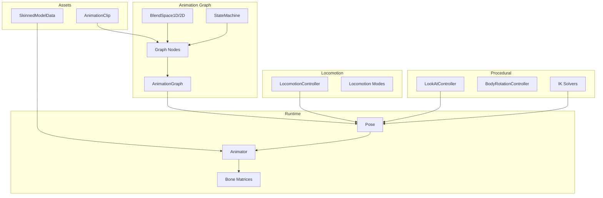

# Animation Overview

MonsterEngine provides skeletal animation with crossfade blending, animation graphs, blend spaces, and procedural animation controllers.

---

## Architecture



---

## Quick Start

### Basic Animation

```cpp
auto character = scene->CreateEntity("Character");

auto& anim = character.AddComponent<se::AnimatorComponent>();
anim.animator = std::make_unique<se::Animator>(model->GetData());

auto idleClip = se::AnimationManager::Load("assets/anims/idle.fbx");
anim.animator->Play(idleClip, true);
```

### Locomotion with Blend Spaces

```cpp
se::anim::LocomotionConfig config;
config.animations.idle = "assets/anims/idle.fbx";
config.animations.walk = "assets/anims/walk.fbx";
config.animations.run = "assets/anims/run.fbx";

se::anim::LocomotionController locomotion;
locomotion.Initialize(config, skeleton);

// In update
locomotion.SetVelocity(characterSpeed);
locomotion.Update(dt, outputPose);
animator->ApplyPose(outputPose);
```

---

## Key Classes

### Core Animation

| Class | Description |
|-------|-------------|
| [Animator](Animator.md) | Playback and blending control |
| [AnimationClip](AnimationClip.md) | Animation data container |
| [Pose](Pose.md) | Skeleton pose representation |

### Animation Graph

| Class | Description |
|-------|-------------|
| [AnimationGraph](AnimationGraph.md) | Node-based animation system |
| [ClipNode](AnimationGraph.md#clipnode) | Plays single clip |
| [BlendNode](AnimationGraph.md#blendnode) | Two-input blending |
| [BlendSpaceNode](BlendSpaces.md) | Velocity/directional blending |
| [StateMachineNode](AnimationGraph.md#statemachinenode) | State machine with transitions |
| [LayerNode](Layers.md) | Partial body animation |

### Locomotion & Procedural

| Class | Description |
|-------|-------------|
| [LocomotionController](LocomotionController.md) | Movement animation controller |
| [LookAtController](ProceduralAnimation.md#lookat) | Procedural spine/head rotation |
| [BodyRotationController](ProceduralAnimation.md#bodyrotation) | Smooth body rotation |

### IK

| Class | Description |
|-------|-------------|
| [TwoBoneIKSolver](IK.md#twoboneik) | Arm/leg IK |
| [BoneAttachment](BoneAttachment.md) | Attach objects to bones |

---

## Animation Blending

### Crossfade

```cpp
animator.Crossfade(runClip, 0.25f, true);
```

### Blend Spaces

Blend between multiple animations based on parameters:

```cpp
// 1D: velocity-based (idle -> walk -> run)
auto blendSpace = std::make_unique<BlendSpace1D>("Locomotion");
blendSpace->AddSample(idleClip, 0.0f);
blendSpace->AddSample(walkClip, 2.0f);
blendSpace->AddSample(runClip, 5.0f);

blendSpace->Evaluate(velocity, pose, time, skeleton);
```

### Animation Layers

Combine animations on different body parts:

```cpp
LayerNode layers;
layers.SetBaseNode(std::make_unique<ClipNode>(locomotionClip));

LayerConfig upperBody;
upperBody.name = "Aim";
upperBody.node = std::make_unique<ClipNode>(aimClip);
upperBody.mask = BoneMask::UpperBody(skeleton);
upperBody.blendMode = LayerBlendMode::Override;

layers.AddLayer(upperBody);
```

---

## Playback Control

```cpp
animator->Play(clip);
animator->Stop();
animator->Pause();
animator->Resume();
animator->SetSpeed(1.5f);
animator->SetTime(0.5f);
```

---

## Bone Matrices

```cpp
const auto& bones = animator->GetBoneMatrices();
glm::mat4 handMatrix = animator->GetBoneWorldMatrix("RightHand");
```

---

## See Also

- [Animator](Animator.md)
- [Animation Graph](AnimationGraph.md)
- [Blend Spaces](BlendSpaces.md)
- [Locomotion Controller](LocomotionController.md)
- [IK System](IK.md)
- [Bone Attachment](BoneAttachment.md)
- [Procedural Animation](ProceduralAnimation.md)
