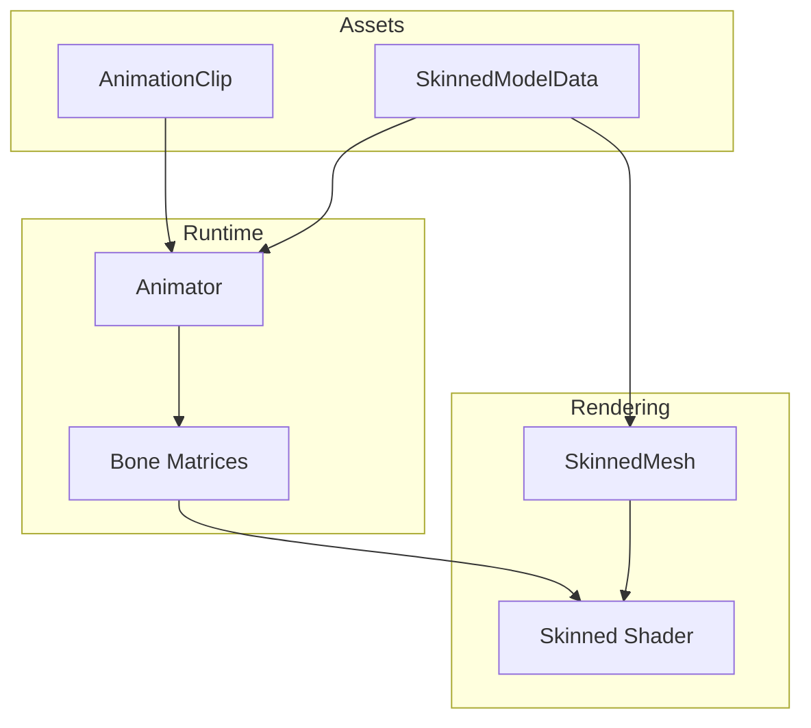

# Animation Overview

MonsterEngine provides skeletal animation with crossfade blending, suitable for character animation in games.

---

## Architecture



---

## Quick Start

### Load a Skinned Model

```cpp
auto* modelManager = se::SkinnedModelManager::Get();
auto model = modelManager->Load("assets/models/character.fbx");
```

### Set Up Animation

```cpp
auto character = scene->CreateEntity("Character");

// Add animator component
auto& anim = character.AddComponent<se::AnimatorComponent>();
anim.animator = std::make_unique<se::Animator>(model->GetData());

// Load and play animation
auto idleClip = se::AnimationManager::Get()->Load("assets/anims/idle.fbx");
anim.animator->Play(idleClip, true);  // true = loop
```

### Update and Render

```cpp
// In OnUpdate
anim.animator->Update(deltaTime);

// Bone matrices are automatically sent to shader
```

---

## Key Classes

| Class | Description |
|-------|-------------|
| [Animator](Animator.md) | Playback and blending control |
| [AnimationClip](AnimationClip.md) | Animation data container |
| [SkinnedModels](SkinnedModels.md) | Model loading and bone data |
| [BoneAttachments](BoneAttachments.md) | Attach objects to bones |

---

## Animation Blending

Smooth transitions between animations:

```cpp
// Crossfade to run animation over 0.25 seconds
anim.animator->Crossfade(runClip, 0.25f, true);

// Check if blending
if (anim.animator->IsBlending()) {
    float blendWeight = anim.animator->GetBlendWeight();
}
```

---

## Playback Control

```cpp
auto* animator = anim.animator.get();

// Control playback
animator->Play(clip);
animator->Stop();
animator->Pause();
animator->Resume();

// Speed
animator->SetSpeed(1.5f);  // 1.5x speed

// Seek
animator->SetTime(0.5f);  // Jump to 0.5 seconds

// Query state
bool playing = animator->IsPlaying();
bool looping = animator->IsLooping();
float time = animator->GetCurrentTime();
```

---

## Bone Matrices

Access bone matrices for custom rendering:

```cpp
const std::vector<glm::mat4>& bones = animator->GetBoneMatrices();

// Send to shader
shader->SetMat4Array("uBoneMatrices", bones);
```

Get a specific bone transform:

```cpp
glm::mat4 handMatrix = animator->GetBoneWorldMatrix("RightHand");
```

---

## Performance

- Bone calculations on CPU
- Skinning on GPU (vertex shader)
- Crossfade blends two poses (2x bone calculations)
- ~100 bones is typical maximum

---

## See Also

- [Animator](Animator.md)
- [AnimationClip](AnimationClip.md)
- [SkinnedModels](SkinnedModels.md)
- [BoneAttachments](BoneAttachments.md)
