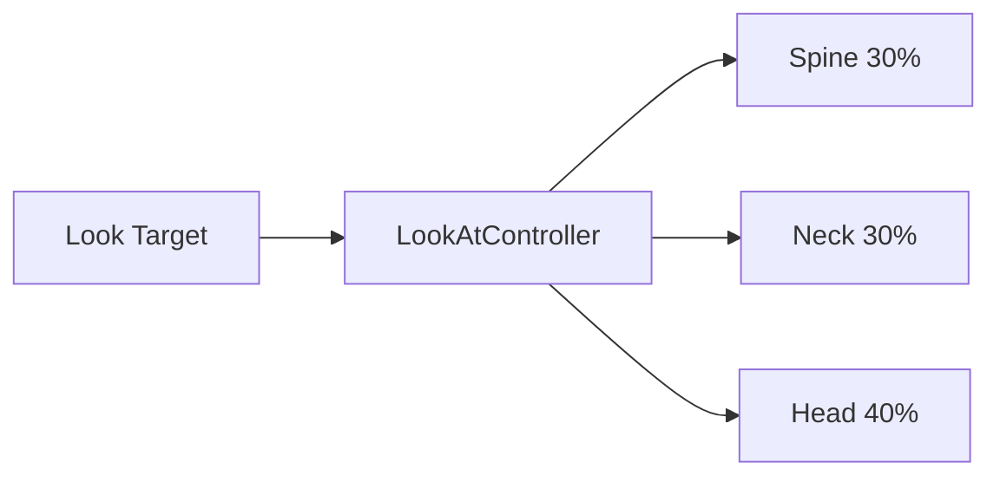
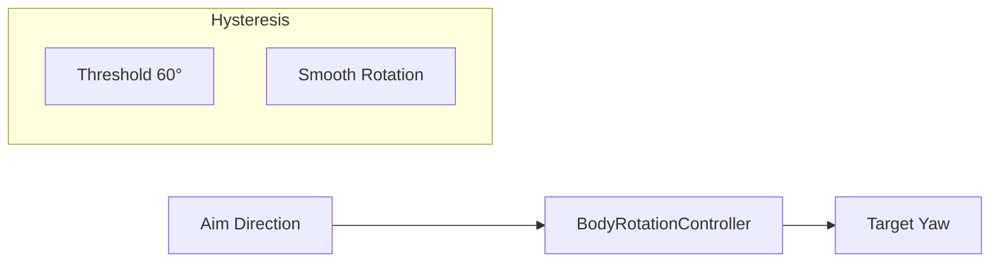

# Procedural Animation

Procedural controllers for runtime-generated animation.

---

## Overview

| Controller | Purpose |
|------------|---------|
| `LookAtController` | Rotate spine/neck/head toward target |
| `BodyRotationController` | Smooth body rotation with hysteresis |

---

## LookAtController

Distributes look-at rotation across multiple bones (spine, neck, head):



### Configuration

```cpp
#include "engine/animation/advanced/LookAtController.h"

LookAtSettings settings = LookAtSettings::DefaultUEMannequin();

// Or customize
settings.spineBoneNames = {"spine_01", "spine_02", "spine_03"};
settings.neckBoneName = "neck_01";
settings.headBoneName = "head";
settings.spineWeight = 0.3f;
settings.neckWeight = 0.3f;
settings.headWeight = 0.4f;
settings.maxYawDegrees = 70.0f;
settings.maxPitchDegrees = 40.0f;
```

### Usage

```cpp
LookAtController lookAt;
lookAt.Initialize(skeleton, settings);

void Update(float dt) {
    glm::vec3 targetPos = GetAimTarget();
    glm::vec3 characterPos = GetWorldPosition();
    glm::vec3 characterForward = GetForward();
    
    lookAt.SetTarget(targetPos);
    lookAt.SetCharacterTransform(characterPos, characterForward);
    lookAt.Update(dt);
    
    lookAt.ApplyToPose(pose);
}
```

### Blend Modes

| Mode | Description |
|------|-------------|
| `Additive` | Adds rotation on top of animation |
| `Override` | Replaces animation rotation |

```cpp
lookAt.SetBlendMode(LookAtBlendMode::Additive);
lookAt.SetWeight(0.8f);  // 80% look-at
```

---

## BodyRotationController

Smooth body rotation with hysteresis threshold:



### Configuration

```cpp
#include "engine/animation/advanced/BodyRotationController.h"

BodyRotationSettings settings = BodyRotationSettings::Default();
settings.rotationThresholdDegrees = 60.0f;  // Start rotating above this
settings.returnThresholdDegrees = 30.0f;    // Stop rotating below this
settings.rotationSpeed = 180.0f;            // Degrees per second
settings.springStiffness = 10.0f;
settings.springDamping = 0.8f;
```

### Usage

```cpp
BodyRotationController bodyRotation;
bodyRotation.Initialize(settings);

void Update(float dt) {
    glm::vec3 aimDirection = camera.GetForward();
    glm::vec3 bodyForward = character.GetForward();
    
    bodyRotation.Update(dt, bodyForward, aimDirection);
    
    if (bodyRotation.ShouldRotate()) {
        float targetYaw = bodyRotation.GetTargetYaw();
        character.SetYaw(targetYaw);
    }
}
```

### Hysteresis

Prevents oscillation at threshold boundaries:

```
         ← Return threshold (30°) →
    ┌────────────────────────────────────┐
    │                                    │
    │       NO ROTATION ZONE             │
    │                                    │
    └────────────────────────────────────┘
         ← Rotation threshold (60°) →
         
When aim exceeds 60°: Start body rotation
When aim returns below 30°: Stop rotation
```

---

## Integration

### With AdvancedAnimatorComponent

```cpp
AdvancedAnimatorConfig config;
config.lookAt = LookAtSettings::DefaultUEMannequin();
config.bodyRotation = BodyRotationSettings::Default();

AdvancedAnimatorComponent animator;
animator.Initialize(config, skeleton);

// Access controllers
LookAtController* lookAt = animator.GetLookAt();
BodyRotationController* bodyRot = animator.GetBodyRotation();
```

### Manual Integration

```cpp
class CharacterAnimator : public se::Component {
    LookAtController lookAt_;
    BodyRotationController bodyRotation_;
    
    void Start() override {
        lookAt_.Initialize(skeleton, LookAtSettings::DefaultUEMannequin());
        bodyRotation_.Initialize(BodyRotationSettings::Default());
    }
    
    void LateUpdate(float dt) override {
        // Look-at
        lookAt_.SetTarget(camera.GetAimPoint());
        lookAt_.SetCharacterTransform(GetPosition(), GetForward());
        lookAt_.Update(dt);
        
        Pose& pose = animator_.GetFinalPose();
        lookAt_.ApplyToPose(pose);
        
        // Body rotation
        bodyRotation_.Update(dt, GetForward(), camera.GetForward());
        if (bodyRotation_.ShouldRotate()) {
            SetYaw(bodyRotation_.GetTargetYaw());
        }
    }
};
```

---

## API Reference

### LookAtController

| Method | Description |
|--------|-------------|
| `Initialize(skeleton, settings)` | Setup with skeleton |
| `SetTarget(position)` | Set world target |
| `SetCharacterTransform(pos, fwd)` | Set character state |
| `Update(dt)` | Update controller |
| `ApplyToPose(pose)` | Apply to pose |
| `SetWeight(float)` | Set blend weight |
| `SetEnabled(bool)` | Enable/disable |

### BodyRotationController

| Method | Description |
|--------|-------------|
| `Initialize(settings)` | Setup with settings |
| `Update(dt, bodyFwd, aimDir)` | Update controller |
| `ShouldRotate()` | Check if rotation needed |
| `GetTargetYaw()` | Get target rotation |
| `SetEnabled(bool)` | Enable/disable |

---

## See Also

- [Animation Overview](Overview.md)
- [Locomotion Controller](LocomotionController.md)
- [IK System](IK.md)
