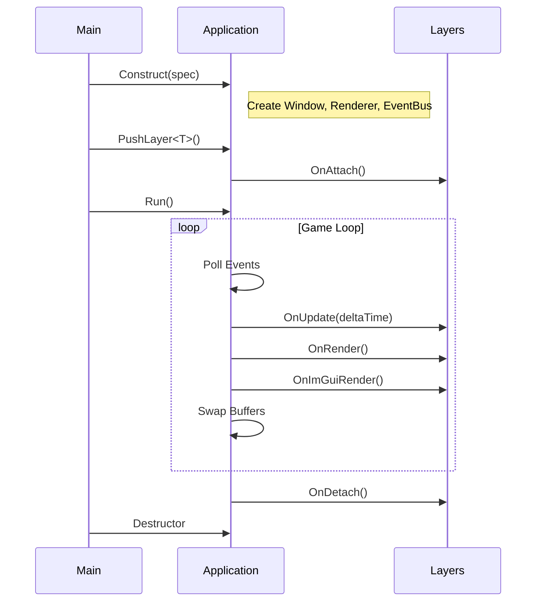

# Application

The `Application` class is the core entry point of MonsterEngine. It manages the main loop, window, renderer, event system, and layer stack.

---

## Overview

Every MonsterEngine application follows this pattern:

```cpp
#include <Engine.h>

int main() {
    se::ApplicationSpecification spec;
    spec.Name = "MyGame";
    spec.WindowWidth = 1920;
    spec.WindowHeight = 1080;
    spec.VSync = true;
    
    se::Application app(spec);
    app.PushLayer<MyGameLayer>();
    return app.Run();
}
```

---

## ApplicationSpecification

Configure your application before construction:

| Property | Type | Default | Description |
|----------|------|---------|-------------|
| `Name` | `string` | `"Simple-Engine"` | Window title |
| `WindowWidth` | `uint32_t` | `800` | Initial window width |
| `WindowHeight` | `uint32_t` | `600` | Initial window height |
| `WindowDecorated` | `bool` | `false` | Show window decorations (title bar, borders) |
| `Fullscreen` | `bool` | `false` | Launch in fullscreen mode |
| `VSync` | `bool` | `true` | Enable vertical sync |
| `StartMaximized` | `bool` | `true` | Start window maximized |
| `Resizable` | `bool` | `true` | Allow window resize |
| `EnableImGui` | `bool` | `true` | Enable ImGui debug UI |
| `WorkingDirectory` | `string` | `""` | Set working directory |
| `IconPath` | `path` | `""` | Window icon path |

---

## Application Lifecycle



---

## Layer System

Layers are the primary way to organize game logic. The engine maintains a stack of layers:

```cpp
class MyGameLayer : public se::Layer {
public:
    MyGameLayer() : Layer("MyGameLayer") {}
    
    void OnAttach() override {
        // Called when layer is added to the stack
        scene_ = std::make_unique<se::Scene>("MainScene");
        // Initialize resources...
    }
    
    void OnDetach() override {
        // Called when layer is removed
        // Cleanup resources...
    }
    
    void OnUpdate(float deltaTime) override {
        // Called every frame
        scene_->OnUpdate(deltaTime);
    }
    
    void OnRender() override {
        // Called after all OnUpdate calls
        scene_->OnRender();
    }
    
    void OnImGuiRender() override {
        // Called during ImGui frame
        ImGui::Begin("Debug");
        ImGui::Text("FPS: %.1f", 1.0f / deltaTime);
        ImGui::End();
    }
    
    void OnEvent(se::Event& event) override {
        // Handle input events
    }
    
private:
    std::unique_ptr<se::Scene> scene_;
};
```

### Layer vs Overlay

- **Layers** are inserted at the bottom of the stack (processed first)
- **Overlays** are added at the top (processed last, rendered on top)

```cpp
app.PushLayer<GameLayer>();    // Game logic
app.PushOverlay<DebugLayer>(); // Debug overlay on top
```

---

## Accessing Application Systems

From anywhere in your code:

```cpp
// Get the singleton instance
se::Application& app = se::Application::Get();

// Access window
se::Window& window = app.GetWindow();
uint32_t width = window.GetWidth();
uint32_t height = window.GetHeight();

// Access renderer
se::Renderer& renderer = app.GetRenderer();

// Access event bus
se::EventBus& events = app.GetEventBus();

// Access active scene
se::Scene* scene = app.GetActiveScene();
```

---

## Active Scene

The application can track an "active scene" for systems that need it:

```cpp
// In your layer
void OnAttach() override {
    scene_ = std::make_unique<se::Scene>("Main");
    se::Application::Get().SetActiveScene(scene_.get());
}
```

---

## Closing the Application

```cpp
// From anywhere
se::Application::Get().Close();
```

The close request is processed at the end of the current frame.

---

## Event Handling

The application forwards all window/input events to layers in reverse order (top to bottom). If a layer handles an event, it can mark it as handled to stop propagation:

```cpp
void OnEvent(se::Event& event) override {
    se::EventDispatcher dispatcher(event);
    
    dispatcher.Dispatch<se::KeyPressedEvent>([this](se::KeyPressedEvent& e) {
        if (e.GetKeyCode() == se::Key::Escape) {
            se::Application::Get().Close();
            return true; // Event handled
        }
        return false;
    });
}
```

---

## See Also

- [Layer System](../tutorials/CreatingALayer.md)
- [Window](Window.md)
- [Event System](../events/EventBus.md)
