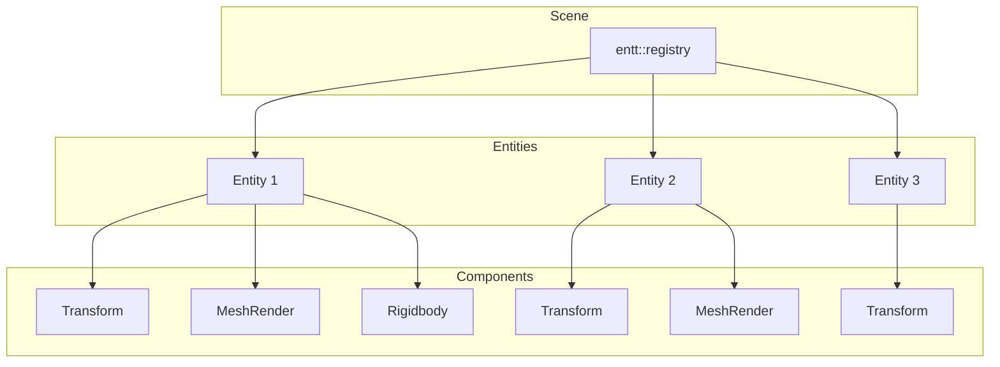
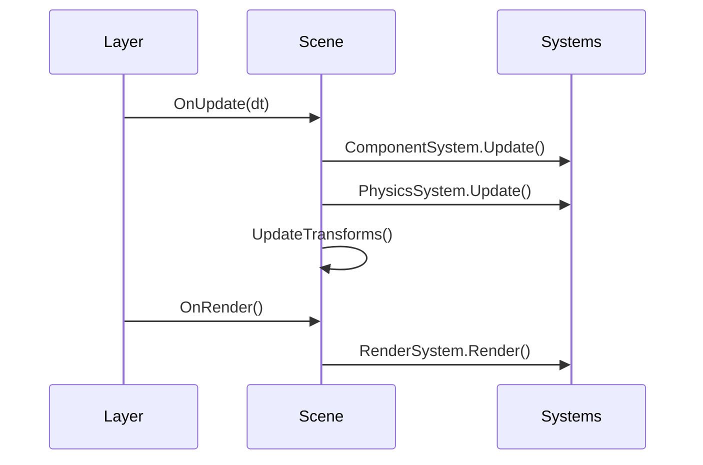

# ECS Overview

MonsterEngine uses [entt](https://github.com/skypjack/entt) as its Entity Component System foundation. This provides a high-performance, cache-friendly way to manage game objects.

---

## Core Concepts

### Entity
A lightweight identifier (just an integer) that represents a game object. Entities have no data themselves—they're just IDs.

### Component
Plain data structs attached to entities. Components contain only data, no logic.

### System
Functions or classes that process entities with specific component combinations.

---

## Architecture



---

## Quick Start

### Creating Entities

```cpp
// Get or create a scene
se::Scene scene("MainScene");

// Create an entity
se::Entity player = scene.CreateEntity("Player");

// Add components
auto& transform = player.AddComponent<se::TransformComponent>();
transform.Position = {0.0f, 5.0f, 0.0f};

auto& mesh = player.AddComponent<se::MeshRenderComponent>();
mesh.vertex_array = se::MeshFactory::Cube();
mesh.material = myMaterial;
```

### Querying Entities

```cpp
// Get all entities with specific components
auto view = scene.GetAllEntitiesWith<se::TransformComponent, se::MeshRenderComponent>();

for (auto entity : view) {
    auto& transform = view.get<se::TransformComponent>(entity);
    auto& mesh = view.get<se::MeshRenderComponent>(entity);
    
    // Process...
}
```

### Checking Components

```cpp
if (entity.HasComponent<se::RigidbodyComponent>()) {
    auto& rb = entity.GetComponent<se::RigidbodyComponent>();
    // ...
}
```

### Removing Components

```cpp
entity.RemoveComponent<se::MeshRenderComponent>();
```

### Destroying Entities

```cpp
scene.DestroyEntity(entity);
```

---

## Built-in Components

MonsterEngine provides these ready-to-use components:

| Component | Purpose |
|-----------|---------|
| `TransformComponent` | Position, rotation, scale with cached matrix |
| `NameComponent` | Entity name/tag |
| `MeshRenderComponent` | 3D mesh with material |
| `DirectionalLightComponent` | Directional light source |
| `SpringArmComponent` | Camera spring arm (3rd person) |
| `RelationshipComponent` | Parent/child hierarchy |
| `RigidbodyComponent` | Physics rigid body |
| `AnimatorComponent` | Skeletal animation |
| `SkinnedModelComponent` | Skinned mesh |
| `ScriptComponent` | Native scripting |

See [Components Reference](Components.md) for full details.

---

## Creating Custom Components

Components are just structs:

```cpp
struct HealthComponent {
    float CurrentHealth = 100.0f;
    float MaxHealth = 100.0f;
    bool IsAlive = true;
    
    float GetHealthPercent() const {
        return CurrentHealth / MaxHealth;
    }
};

// Use immediately
player.AddComponent<HealthComponent>();
```

---

## Scene Lifecycle



The scene automatically:
1. Updates all `Component`-derived scripts
2. Steps physics simulation
3. Updates transform hierarchies
4. Renders all visible entities

---

## Key Classes

| Class | Description |
|-------|-------------|
| [Scene](Scene.md) | Container for entities and systems |
| [Entity](Entity.md) | Wrapper for entity handle |
| [Components](Components.md) | Built-in component types |
| [Systems](Systems.md) | RenderSystem, AnimationSystem |
| [Scripting](Scripting.md) | Component-based scripts |

---

## Performance Tips

1. **Component Layout**: Keep components small and focused
2. **Views**: Use `GetAllEntitiesWith<>()` for efficient iteration
3. **Avoid Polymorphism**: Prefer data-oriented design over inheritance
4. **Batch Operations**: Group similar operations together

---

## See Also

- [entt Documentation](https://github.com/skypjack/entt/wiki)
- [Tutorial: Adding Entities](../tutorials/AddingEntities.md)
- [Tutorial: Custom Components](../tutorials/CustomComponents.md)
