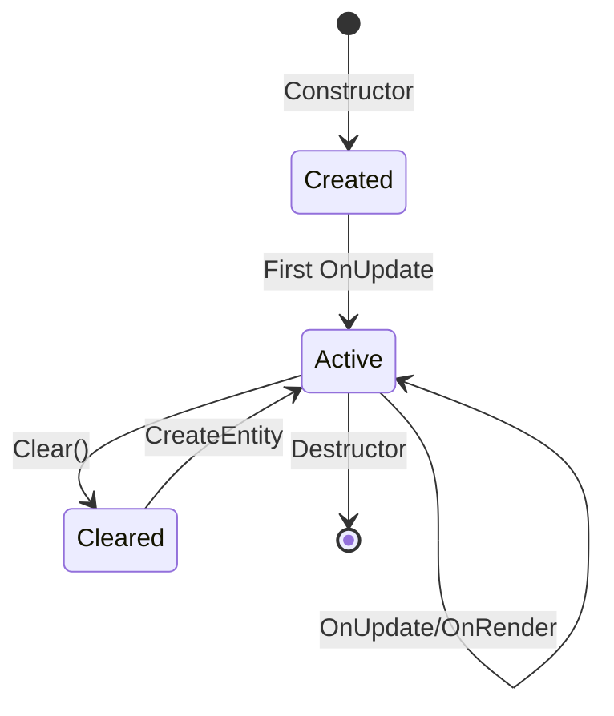

# Scene

The `Scene` class is the container for all entities in a game level. It owns the entt registry, physics system, and component system.

---

## Creating a Scene

```cpp
#include "engine/ecs/Scene.h"

// Basic scene
auto scene = std::make_unique<se::Scene>("MainLevel");

// With custom settings
se::SceneSettings settings;
settings.EnablePhysics = true;

auto scene = std::make_unique<se::Scene>("PhysicsLevel", settings);
```

---

## SceneSettings

| Property | Type | Default | Description |
|----------|------|---------|-------------|
| `EnablePhysics` | `bool` | `true` | Create PhysicsSystem for this scene |

---

## Scene Lifecycle



### Construction

```cpp
se::Scene scene("MyScene");
// Registry is ready, physics initialized if enabled
```

### Update Loop

```cpp
void MyLayer::OnUpdate(float deltaTime) {
    // Updates all systems
    scene_->OnUpdate(deltaTime);
}

void MyLayer::OnRender() {
    // Renders with active camera
    scene_->OnRender();
    
    // Or with explicit camera
    scene_->OnRender(camera_, aspectRatio_);
}
```

### Destruction

```cpp
// Automatic cleanup when scene goes out of scope
// Or manually clear entities:
scene_->Clear();
```

---

## Entity Management

### Creating Entities

```cpp
// Create with default name
se::Entity entity = scene->CreateEntity();

// Create with name
se::Entity player = scene->CreateEntity("Player");
```

Every entity automatically gets:
- `TransformComponent` (position, rotation, scale)
- `NameComponent` (the name you provide)

### Finding Entities

```cpp
// By name (returns invalid entity if not found)
se::Entity player = scene->FindEntityByName("Player");
if (player) {
    // Found!
}
```

### Destroying Entities

```cpp
scene->DestroyEntity(entity);
// Entity is immediately removed from registry
```

### Querying Entities

```cpp
// Get all entities with specific components
auto view = scene->GetAllEntitiesWith<
    se::TransformComponent,
    se::MeshRenderComponent
>();

for (auto entityHandle : view) {
    auto [transform, mesh] = view.get<
        se::TransformComponent,
        se::MeshRenderComponent
    >(entityHandle);
    
    // Process...
}
```

### Entity Count

```cpp
size_t count = scene->GetEntityCount();
```

---

## Camera Management

Scenes can track an "active camera" for rendering:

```cpp
// Set active camera
Camera camera;
scene->SetActiveCamera(&camera);

// Get active camera
Camera* cam = scene->GetActiveCamera();

// Render with active camera (no parameters needed)
scene->OnRender();
```

If no active camera is set, `OnRender()` without parameters will not render anything.

---

## Physics System

If physics is enabled (`SceneSettings::EnablePhysics = true`), the scene owns a `PhysicsSystem`:

```cpp
// Check if physics is available
if (scene->HasPhysics()) {
    se::PhysicsSystem* physics = scene->GetPhysicsSystem();
    
    // Configure physics
    physics->SetPreTickCallback([](float dt) {
        // Called before each physics substep
    });
    
    // Raycast
    glm::vec3 hitPoint, hitNormal;
    if (physics->Raycast(start, end, hitPoint, hitNormal)) {
        // Hit something
    }
}
```

See [Physics System](../physics/PhysicsSystem.md) for full details.

---

## Component System

The scene owns a `ComponentSystem` for managing `Component`-derived scripts:

```cpp
se::ComponentSystem* compSys = scene->GetComponentSystem();
```

This system:
- Calls `Start()` on newly added components
- Calls `Update()` every frame
- Manages component lifecycle

See [Scripting](Scripting.md) for details.

---

## Registry Access

For advanced use cases, you can access the raw entt registry:

```cpp
entt::registry& registry = scene->GetRegistry();

// Direct entt operations
registry.view<TransformComponent>().each([](auto& transform) {
    // ...
});
```

---

## What Happens in OnUpdate

```cpp
void Scene::OnUpdate(float deltaTime) {
    // 1. Update all Component-derived scripts
    component_system_->Update(deltaTime);
    
    // 2. Step physics simulation
    if (physics_system_) {
        physics_system_->Update(deltaTime);
    }
    
    // 3. Update transform hierarchies
    UpdateTransforms();
}
```

---

## What Happens in OnRender

```cpp
void Scene::OnRender() {
    if (!active_camera_) return;
    
    // Get renderer from Application
    auto& renderer = Application::Get().GetRenderer();
    
    // RenderSystem processes all visible entities
    RenderSystem::RenderScene(registry_, *active_camera_, aspectRatio);
}
```

---

## Example: Complete Scene Setup

```cpp
class GameLayer : public se::Layer {
public:
    void OnAttach() override {
        // Create scene with physics
        se::SceneSettings settings;
        settings.EnablePhysics = true;
        scene_ = std::make_unique<se::Scene>("GameScene", settings);
        
        // Set as active scene
        se::Application::Get().SetActiveScene(scene_.get());
        
        // Setup camera
        camera_ = std::make_unique<Camera>();
        camera_->SetPerspective(45.0f, 0.1f, 1000.0f);
        scene_->SetActiveCamera(camera_.get());
        
        // Create ground
        auto ground = scene_->CreateEntity("Ground");
        auto& groundTransform = ground.GetComponent<se::TransformComponent>();
        groundTransform.Scale = {100.0f, 1.0f, 100.0f};
        
        auto& groundMesh = ground.AddComponent<se::MeshRenderComponent>();
        groundMesh.vertex_array = se::MeshFactory::Cube();
        
        // Create player with physics
        auto player = scene_->CreateEntity("Player");
        // ... add components
    }
    
    void OnUpdate(float dt) override {
        scene_->OnUpdate(dt);
    }
    
    void OnRender() override {
        scene_->OnRender();
    }
    
private:
    std::unique_ptr<se::Scene> scene_;
    std::unique_ptr<Camera> camera_;
};
```

---

## See Also

- [Entity](Entity.md)
- [Components](Components.md)
- [Physics System](../physics/PhysicsSystem.md)
