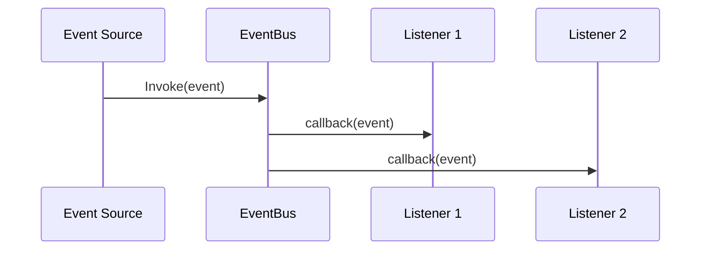

# EventBus

The `EventBus` provides a type-safe event system for decoupled communication between engine systems.

---

## Overview

Events allow loose coupling:

```cpp
// Subscribe to events
eventBus.Subscribe<WindowResizeEvent>([](const WindowResizeEvent& e) {
    Logger::Info("Window resized to {}x{}", e.Width, e.Height);
});

// Fire events
eventBus.Invoke(WindowResizeEvent{1920, 1080});
```

---

## Subscribing to Events

```cpp
se::EventBus& bus = se::Application::Get().GetEventBus();

// Lambda subscription
bus.Subscribe<se::KeyPressedEvent>([](const se::KeyPressedEvent& e) {
    if (e.KeyCode == se::Key::Escape) {
        se::Application::Get().Close();
    }
});

// Method subscription
bus.Subscribe<se::WindowResizeEvent>(
    std::bind(&MyClass::OnResize, this, std::placeholders::_1)
);
```

---

## Firing Events

```cpp
// Fire immediately
bus.Invoke(se::KeyPressedEvent{se::Key::Space, false});

// Custom events
struct PlayerDiedEvent {
    int playerIndex;
    float x, y, z;
};

bus.Invoke(PlayerDiedEvent{0, 10.0f, 0.0f, 5.0f});
```

---

## Built-in Events

### Window Events

```cpp
struct WindowResizeEvent {
    uint32_t Width;
    uint32_t Height;
};

struct WindowCloseEvent {};

struct WindowMinimizeEvent {
    bool Minimized;
};
```

### Input Events

```cpp
struct KeyPressedEvent {
    Key KeyCode;
    bool IsRepeat;
};

struct KeyReleasedEvent {
    Key KeyCode;
};

struct MouseButtonPressedEvent {
    Mouse Button;
};

struct MouseButtonReleasedEvent {
    Mouse Button;
};

struct MouseMovedEvent {
    float X;
    float Y;
};

struct MouseScrolledEvent {
    float XOffset;
    float YOffset;
};
```

---

## Creating Custom Events

Events are just structs:

```cpp
struct GameOverEvent {
    int WinningTeam;
    float GameDuration;
};

struct EnemyKilledEvent {
    int EnemyId;
    glm::vec3 Position;
    int KillerPlayerId;
};

// Subscribe
bus.Subscribe<EnemyKilledEvent>([&](const EnemyKilledEvent& e) {
    score += 100;
    SpawnPickup(e.Position);
});

// Fire
bus.Invoke(EnemyKilledEvent{enemyId, position, playerId});
```

---

## Event Flow



---

## Example: Achievement System

```cpp
class AchievementSystem {
public:
    void Initialize(se::EventBus& bus) {
        bus.Subscribe<EnemyKilledEvent>([this](const EnemyKilledEvent& e) {
            killCount_++;
            CheckKillAchievements();
        });
        
        bus.Subscribe<LevelCompleteEvent>([this](const LevelCompleteEvent& e) {
            levelsComplete_++;
            CheckLevelAchievements();
        });
    }
    
private:
    void CheckKillAchievements() {
        if (killCount_ >= 100 && !hasKillAchievement_) {
            hasKillAchievement_ = true;
            ShowAchievement("100 Kills!");
        }
    }
    
    int killCount_ = 0;
    bool hasKillAchievement_ = false;
};
```

---

## See Also

- [EventChannel](EventChannel.md)
- [Built-in Events](BuiltInEvents.md)
- [InputManager](../input/InputManager.md)
