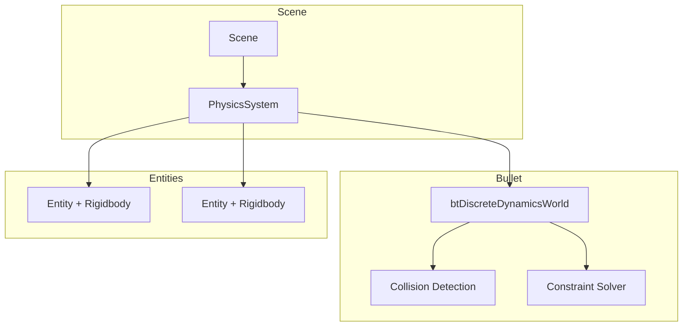
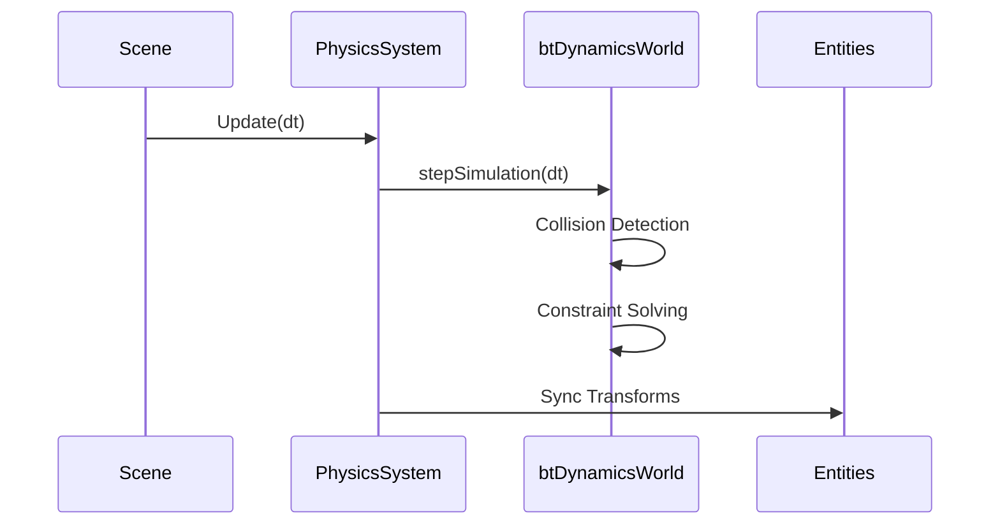

# Physics Overview

MonsterEngine integrates Bullet Physics for 3D rigid body simulation. This provides realistic collision detection, gravity, and physical interactions.

---

## Architecture



---

## Quick Start

### Enable Physics for Scene

```cpp
se::SceneSettings settings;
settings.EnablePhysics = true;

auto scene = std::make_unique<se::Scene>("Game", settings);
```

### Add a Rigidbody

```cpp
auto box = scene->CreateEntity("Box");

// Configure transform
auto& transform = box.GetComponent<se::TransformComponent>();
transform.Position = {0.0f, 10.0f, 0.0f};

// Create rigidbody data
se::RigidbodyData data;
data.mass = 1.0f;
data.shapeType = se::ColliderType::Box;
data.boxHalfExtents = {0.5f, 0.5f, 0.5f};

// Add to physics
auto* physics = scene->GetPhysicsSystem();
auto& rb = box.AddComponent<se::RigidbodyComponent>();
rb.Body = physics->AddRigidBody(box, data);
```

---

## Key Classes

| Class | Description |
|-------|-------------|
| [PhysicsSystem](PhysicsSystem.md) | Main physics manager |
| [Rigidbodies](Rigidbodies.md) | Rigid body components and data |
| [Colliders](Colliders.md) | Collision shapes |
| [Raycasting](Raycasting.md) | Ray queries |
| [DebugDraw](DebugDraw.md) | Physics visualization |

---

## Configuration

```cpp
se::PhysicsConfig config;
config.gravity = -9.81f;          // Gravity strength
config.fixedTimeStep = 1.0f/60.0f; // 60 Hz simulation
config.maxSubSteps = 10;          // Max substeps per frame
config.solverIterations = 4;       // Constraint solver iterations

physics->Initialize(config);
```

See [PhysicsSystem](PhysicsSystem.md) for full configuration options.

---

## Collider Types

```cpp
enum class ColliderType {
    Box,
    Sphere,
    Capsule,
    Mesh,      // Static only
    Compound   // Multiple shapes
};
```

---

## Raycasting

```cpp
glm::vec3 hitPoint, hitNormal;

if (physics->Raycast(start, end, hitPoint, hitNormal)) {
    // Hit something at hitPoint
}

// Get the hit body
btRigidBody* hitBody = physics->RaycastHitBody(start, end, hitPoint);
```

---

## Update Flow



The physics system:
1. Steps the simulation
2. Syncs physics transforms back to entity `TransformComponent`

---

## Coordinate System

Bullet uses the same coordinate system as the engine:
- **+X**: Right
- **+Y**: Up
- **-Z**: Forward

---

## Performance Tips

1. **Use Simple Shapes**: Box/Sphere are much faster than Mesh
2. **Sleep Bodies**: Bodies automatically sleep when at rest
3. **Batch Raycasts**: Use async raycasts for many queries
4. **Reduce Solver Iterations**: 4-6 is usually enough

---

## Next Steps

- [PhysicsSystem](PhysicsSystem.md) - Full system documentation
- [Rigidbodies](Rigidbodies.md) - Rigidbody configuration
- [Colliders](Colliders.md) - Shape types and setup
- [Tutorial: Using Physics](../tutorials/UsingPhysics.md)
