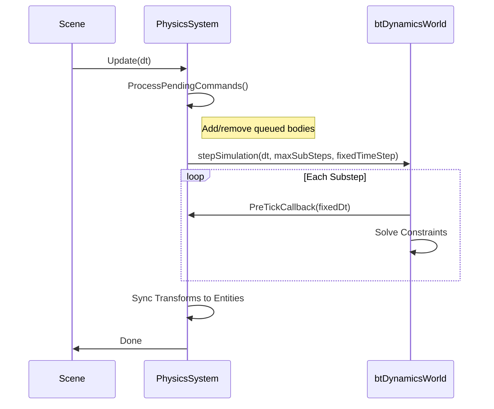

# PhysicsSystem

The `PhysicsSystem` class manages the Bullet Physics world and all rigid bodies in the scene.

---

## Initialization

The physics system is automatically created when `SceneSettings::EnablePhysics = true`:

```cpp
se::SceneSettings settings;
settings.EnablePhysics = true;

auto scene = std::make_unique<se::Scene>("Game", settings);
auto* physics = scene->GetPhysicsSystem();
```

### Custom Configuration

```cpp
se::PhysicsConfig config;
config.gravity = -9.81f;
config.fixedTimeStep = 1.0f / 60.0f;
config.maxSubSteps = 10;
config.solverIterations = 4;

physics->Initialize(config);
```

---

## PhysicsConfig

| Property | Type | Default | Description |
|----------|------|---------|-------------|
| `gravity` | `float` | `-9.81` | Gravity acceleration |
| `fixedTimeStep` | `float` | `1/60` | Physics timestep (60 Hz) |
| `maxSubSteps` | `int` | `10` | Max substeps to catch up |
| `linearSleepThreshold` | `float` | `0.8` | Linear velocity for sleep |
| `angularSleepThreshold` | `float` | `1.0` | Angular velocity for sleep |
| `deactivationTime` | `float` | `2.0` | Seconds before sleeping |
| `parallelThreshold` | `size_t` | `50` | Bodies for parallel solving |
| `solverIterations` | `int` | `4` | Constraint iterations |

---

## Adding Rigid Bodies

```cpp
se::RigidbodyData data;
data.mass = 10.0f;
data.shapeType = se::ColliderType::Box;
data.boxHalfExtents = {1.0f, 1.0f, 1.0f};
data.friction = 0.5f;
data.restitution = 0.3f;

btRigidBody* body = physics->AddRigidBody(entity, data);
```

The returned `btRigidBody*` can be stored in a `RigidbodyComponent`.

---

## Removing Rigid Bodies

```cpp
physics->RemoveRigidBody(body);
```

Bodies are automatically removed when the physics system shuts down.

---

## Raycasting

### Synchronous Raycast

```cpp
glm::vec3 hitPoint, hitNormal;

// Simple raycast
if (physics->Raycast(start, end, hitPoint, hitNormal)) {
    Logger::Info("Hit at {}, {}, {}", hitPoint.x, hitPoint.y, hitPoint.z);
}

// Raycast ignoring a specific body
btRigidBody* ignored = playerBody;
if (physics->Raycast(start, end, hitPoint, hitNormal, ignored)) {
    // Hit something other than player
}
```

### Get Hit Body

```cpp
btRigidBody* hitBody = physics->RaycastHitBody(start, end, hitPoint);
if (hitBody) {
    // Access the hit body
}
```

### Thread-Safe Raycast

For raycasting during physics update:

```cpp
if (physics->RaycastSync(start, end, hitPoint, hitNormal)) {
    // Safe to call from any thread
}
```

---

## Pre-Tick Callback

Execute code before each physics substep:

```cpp
physics->SetPreTickCallback([](float fixedDt) {
    // This runs at physics rate (60 Hz)
    // Good for character controllers, vehicle physics
});
```

---

## Debug Visualization

```cpp
// Render physics shapes
physics->RenderDebug(camera);

// Control debug drawing
physics->UpdateDebugDraw(deltaTime);
```

See [Debug Draw](DebugDraw.md) for more options.

---

## Accessing Bullet World

For advanced Bullet operations:

```cpp
btDiscreteDynamicsWorld* world = physics->GetDynamicsWorld();

// Example: add a constraint
btTypedConstraint* constraint = /* ... */;
world->addConstraint(constraint);
```

---

## Statistics

```cpp
size_t activeCount = physics->GetActiveBodyCount();
size_t sleepingCount = physics->GetSleepingBodyCount();
float execTime = physics->GetLastPhysicsExecutionTime();
bool isIdle = physics->IsIdle();  // All bodies sleeping
```

---

## Thread Safety

The physics system is designed for single-threaded update but supports:
- Parallel constraint solving (for many bodies)
- Thread-safe raycasting via `RaycastSync`

Lock access when modifying during simulation:

```cpp
std::lock_guard<std::mutex> lock(physics->GetMutex());
// Safe to add/remove bodies
```

---

## Update Cycle



---

## Example: Complete Physics Setup

```cpp
class PhysicsLayer : public se::Layer {
public:
    void OnAttach() override {
        // Create physics-enabled scene
        se::SceneSettings settings;
        settings.EnablePhysics = true;
        scene_ = std::make_unique<se::Scene>("Physics", settings);
        
        auto* physics = scene_->GetPhysicsSystem();
        
        // Configure physics
        se::PhysicsConfig config;
        config.gravity = -20.0f;  // Stronger gravity
        physics->Initialize(config);
        
        // Create ground (static)
        auto ground = scene_->CreateEntity("Ground");
        ground.GetComponent<se::TransformComponent>().Scale = {50, 1, 50};
        
        se::RigidbodyData groundData;
        groundData.mass = 0.0f;  // Static
        groundData.shapeType = se::ColliderType::Box;
        groundData.boxHalfExtents = {25, 0.5f, 25};
        physics->AddRigidBody(ground, groundData);
        
        // Create falling boxes
        for (int i = 0; i < 10; i++) {
            auto box = scene_->CreateEntity("Box");
            box.GetComponent<se::TransformComponent>().Position = 
                {0, 5.0f + i * 2.0f, 0};
            
            se::RigidbodyData boxData;
            boxData.mass = 1.0f;
            boxData.shapeType = se::ColliderType::Box;
            boxData.boxHalfExtents = {0.5f, 0.5f, 0.5f};
            physics->AddRigidBody(box, boxData);
        }
    }
    
    void OnUpdate(float dt) override {
        scene_->OnUpdate(dt);
        
        // Debug render physics
        if (debugDraw_) {
            scene_->GetPhysicsSystem()->RenderDebug(camera_);
        }
    }
};
```

---

## See Also

- [Physics Overview](Overview.md)
- [Rigidbodies](Rigidbodies.md)
- [Colliders](Colliders.md)
- [Raycasting](Raycasting.md)
