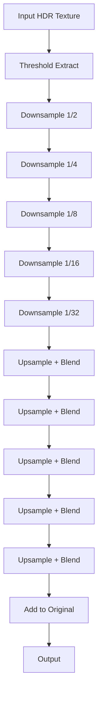

# Bloom Pass

The Bloom pass creates a glowing effect around bright areas of the image, simulating how real cameras capture very bright light sources.

---

## Overview

Bloom works by:
1. Extracting pixels above a brightness threshold
2. Progressively downsampling (blur)
3. Progressively upsampling (combine)
4. Adding the result back to the scene

---

## Configuration

```cpp
auto* bloom = pipeline.GetPass<se::BloomPass>();

// Set threshold - pixels brighter than this will bloom
bloom->SetThreshold(1.0f);

// Set intensity - strength of the bloom effect
bloom->SetIntensity(0.3f);
```

### Properties

| Property | Type | Range | Default | Description |
|----------|------|-------|---------|-------------|
| `threshold` | `float` | 0.0+ | 1.612 | Brightness threshold for bloom |
| `softKnee` | `float` | 0.0-1.0 | 0.084 | Soft threshold transition |
| `intensity` | `float` | 0.0+ | 0.088 | Bloom strength |
| `filterRadius` | `float` | 0.0+ | 0.001 | Blur filter radius |

---

## Algorithm



The pass uses 6 mip levels for smooth, wide bloom.

---

## ImGui Controls

The pass provides built-in ImGui controls:

```cpp
// In your ImGuiRender
bloom->RenderUI();
```

This displays sliders for:
- Threshold
- Intensity

---

## Example

```cpp
// Subtle bloom for realism
bloom->SetThreshold(2.0f);
bloom->SetIntensity(0.1f);

// Strong bloom for stylized look
bloom->SetThreshold(0.8f);
bloom->SetIntensity(0.5f);

// Disable bloom
bloom->SetEnabled(false);
```

---

## Performance

- Uses progressive downsampling (efficient blur)
- 6 mip levels total
- GPU bandwidth is the main cost
- Consider lower mip count for mobile

---

## See Also

- [Post-Processing Overview](Overview.md)
- [Tonemapping](Tonemapping.md)
