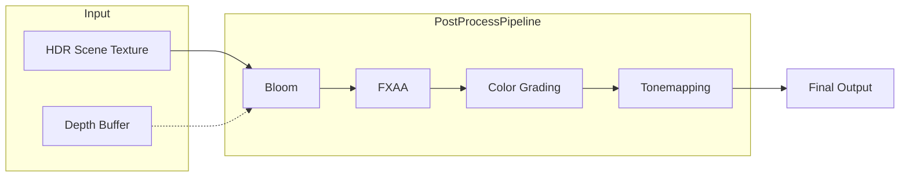

# Post-Processing Overview

MonsterEngine features a modular post-processing pipeline that processes the HDR scene buffer through a series of configurable passes.

---

## Architecture



The pipeline uses ping-pong framebuffers to chain passes efficiently.

---

## Pipeline Class

```cpp
#include "engine/renderer/PostProcessPipeline.h"

se::PostProcessPipeline pipeline;

// Initialize with screen dimensions
pipeline.Init(width, height);

// Resize when window changes
pipeline.Resize(newWidth, newHeight);

// Execute all passes
pipeline.Execute(sceneTexture, depthTexture, targetFBO);

// Cleanup
pipeline.Shutdown();
```

---

## Adding Passes

Passes are added with `AddPass<T>()`:

```cpp
// Add passes in desired execution order
auto* bloom = pipeline.AddPass<se::BloomPass>();
auto* fxaa = pipeline.AddPass<se::FXAAPass>();
auto* colorGrading = pipeline.AddPass<se::ColorGradingPass>();
auto* tonemap = pipeline.AddPass<se::TonemappingPass>();

// Configure passes
bloom->SetThreshold(1.0f);
bloom->SetIntensity(0.5f);

tonemap->SetExposure(1.0f);
tonemap->SetOperator(se::TonemapOperator::ACES);
```

---

## Accessing Passes

```cpp
// Get a specific pass by type
se::BloomPass* bloom = pipeline.GetPass<se::BloomPass>();
if (bloom) {
    bloom->SetThreshold(1.2f);
}

// Check initialization
if (pipeline.IsInitialized()) {
    // Safe to use
}

// Get pass count
size_t count = pipeline.GetPassCount();
```

---

## Built-in Passes

| Pass | Purpose |
|------|---------|
| [BloomPass](Bloom.md) | HDR bloom/glow effect |
| [SSAOPass](SSAO.md) | Screen-space ambient occlusion |
| [SSGIPass](SSGI.md) | Screen-space global illumination |
| [FXAAPass](FXAA.md) | Fast approximate anti-aliasing |
| [ColorGradingPass](ColorGrading.md) | Color adjustments, vignette |
| [TonemappingPass](Tonemapping.md) | HDR to LDR conversion |
| [SSRPass](SSR.md) | Screen-space reflections |
| [TAAPass](TAA.md) | Temporal anti-aliasing |

---

## PostProcessPass Base Class

All passes inherit from `PostProcessPass`:

```cpp
class PostProcessPass {
public:
    virtual void Init(uint32_t width, uint32_t height) = 0;
    virtual void Shutdown() = 0;
    virtual void Resize(uint32_t width, uint32_t height) = 0;
    virtual void Execute(GLuint inputTexture, GLuint outputFBO) = 0;
    virtual void RenderUI() {}  // Optional ImGui controls
    virtual const char* GetName() const = 0;
    
    void SetEnabled(bool enabled) { enabled_ = enabled; }
    bool IsEnabled() const { return enabled_; }

protected:
    bool enabled_ = true;
    uint32_t width_ = 0;
    uint32_t height_ = 0;
};
```

---

## Pass Execution Order

Passes execute in the order they were added:

```cpp
// Execution order: Bloom → FXAA → ColorGrading → Tonemap
pipeline.AddPass<se::BloomPass>();
pipeline.AddPass<se::FXAAPass>();
pipeline.AddPass<se::ColorGradingPass>();
pipeline.AddPass<se::TonemappingPass>();
```

---

## Enabling/Disabling Passes

```cpp
auto* bloom = pipeline.GetPass<se::BloomPass>();
bloom->SetEnabled(false);  // Skip this pass

// Re-enable
bloom->SetEnabled(true);
```

---

## ImGui Integration

Each pass can provide ImGui controls:

```cpp
// In your ImGui render function
pipeline.RenderUI();

// This calls RenderUI() on each pass, which might show:
// - Bloom: threshold, intensity sliders
// - Tonemapping: exposure, gamma, operator selection
// - Color Grading: saturation, contrast, etc.
```

---

## Example: Complete Post-Process Setup

```cpp
class GameLayer : public se::Layer {
public:
    void OnAttach() override {
        auto& renderer = se::Application::Get().GetRenderer();
        auto* pipeline = renderer.GetSceneRenderer().GetPostProcessPipeline();
        
        // Configure Bloom
        if (auto* bloom = pipeline->GetPass<se::BloomPass>()) {
            bloom->SetThreshold(1.0f);
            bloom->SetIntensity(0.3f);
        }
        
        // Configure SSAO (special pass, part of SceneRenderer)
        if (auto* ssao = renderer.GetSceneRenderer().GetSSAOPass()) {
            ssao->SetRadius(0.5f);
            ssao->SetIntensity(1.5f);
        }
        
        // Configure Color Grading
        if (auto* cg = pipeline->GetPass<se::ColorGradingPass>()) {
            cg->Saturation() = 1.1f;
            cg->Contrast() = 1.05f;
            cg->VignetteIntensity() = 0.3f;
        }
        
        // Configure Tonemapping
        if (auto* tonemap = pipeline->GetPass<se::TonemappingPass>()) {
            tonemap->SetOperator(se::TonemapOperator::ACES);
            tonemap->SetExposure(1.0f);
            tonemap->SetGamma(2.2f);
        }
    }
    
    void OnImGuiRender() override {
        ImGui::Begin("Post-Processing");
        
        auto* pipeline = GetPostProcessPipeline();
        pipeline->RenderUI();
        
        ImGui::End();
    }
};
```

---

## Performance Considerations

1. **Pass Count**: Each pass adds GPU cost
2. **Resolution**: Some passes work at reduced resolution (SSGI uses 0.5x)
3. **Disable Unused**: Set `enabled_ = false` for unused passes
4. **Order Matters**: Put cheap passes after expensive ones when possible

---

## Creating Custom Passes

See [How to Add New Pass](HowToAddNewPass.md) for a complete guide.

Quick overview:

```cpp
class MyCustomPass : public se::PostProcessPass {
public:
    void Init(uint32_t width, uint32_t height) override;
    void Shutdown() override;
    void Resize(uint32_t width, uint32_t height) override;
    void Execute(GLuint inputTexture, GLuint outputFBO) override;
    const char* GetName() const override { return "MyCustom"; }
    void RenderUI() override;  // Optional
};
```

---

## See Also

- [Bloom](Bloom.md)
- [SSAO](SSAO.md)
- [SSGI](SSGI.md)
- [Tonemapping](Tonemapping.md)
- [How to Add New Pass](HowToAddNewPass.md)
