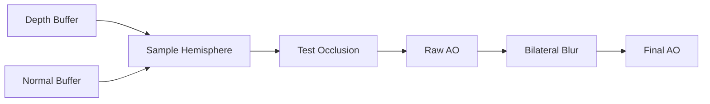

# SSAO Pass

Screen-Space Ambient Occlusion (SSAO) adds subtle shadowing in corners and crevices, improving depth perception and realism.

---

## Overview

SSAO samples the depth buffer around each pixel to detect nearby geometry that would occlude ambient light. This creates soft contact shadows without expensive ray tracing.

---

## Configuration

```cpp
// SSAO is accessed through SceneRenderer, not PostProcessPipeline
auto* ssao = sceneRenderer.GetSSAOPass();

ssao->SetRadius(0.5f);      // Sample radius
ssao->SetIntensity(1.5f);   // Effect strength
```

### Properties

| Property | Type | Range | Default | Description |
|----------|------|-------|---------|-------------|
| `radius` | `float` | 0.1-2.0 | 0.5 | Occlusion sample radius |
| `intensity` | `float` | 0.0-5.0 | 1.5 | Occlusion darkness |
| `bias` | `float` | 0.0-0.1 | 0.025 | Depth bias to prevent self-occlusion |
| `kernelSize` | `int` | 8-64 | 32 | Number of samples per pixel |
| `blurSize` | `int` | 2-8 | 4 | Blur kernel size |

---

## Algorithm



1. For each pixel, sample points in a hemisphere around the surface
2. Compare sample depth to actual depth at that position
3. If sample is closer, it occludes the pixel
4. Blur to reduce noise while preserving edges

---

## Required Inputs

The pass needs GBuffer data:

```cpp
ssao->SetDepthTexture(depthTex);
ssao->SetNormalTexture(normalTex);
ssao->SetProjectionMatrix(projMatrix);
ssao->SetViewMatrix(viewMatrix);
```

These are automatically set by `SceneRenderer`.

---

## ImGui Controls

```cpp
ssao->RenderUI();  // Shows radius and intensity sliders
```

---

## Example Settings

```cpp
// Subtle AO for realistic indoor scenes
ssao->SetRadius(0.3f);
ssao->SetIntensity(1.0f);

// Strong AO for stylized look
ssao->SetRadius(1.0f);
ssao->SetIntensity(2.5f);

// Wide AO for large-scale occlusion
ssao->SetRadius(2.0f);
ssao->SetIntensity(0.8f);
```

---

## Output

Access the AO texture for custom use:

```cpp
GLuint aoTexture = ssao->GetAOTexture();
```

This is automatically multiplied into the ambient lighting in the main pass.

---

## Performance

- 32 samples per pixel by default
- Bilateral blur preserves edges
- Consider reducing kernel size for better performance
- Works at full resolution

---

## Debug Visualization

```cpp
sceneRenderer.SetDebugMode(1);  // Visualize AO only
```

---

## See Also

- [Post-Processing Overview](Overview.md)
- [SSGI](SSGI.md)
- [SceneRenderer](../renderer/SceneRenderer.md)
