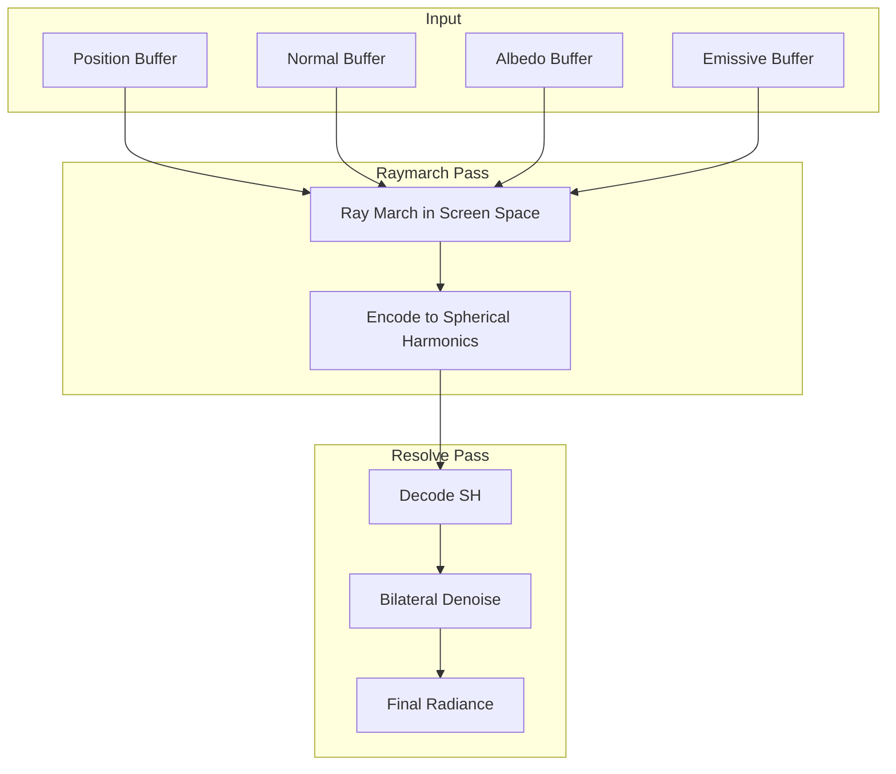

# SSGI Pass

Screen-Space Global Illumination (SSGI) approximates indirect lighting bounced from visible surfaces, adding realistic color bleeding and ambient light.

---

## Overview

SSGI traces rays in screen space to gather indirect lighting from nearby surfaces. The implementation uses:
- Horizon-based ray marching
- Spherical harmonics for light encoding
- Bilateral denoising

---

## Enabling SSGI

```cpp
// Access through SceneRenderer
auto* ssgi = sceneRenderer.GetSSGIPass();

ssgi->SetEnabled(true);
```

---

## Configuration

```cpp
se::SSGIConfig& config = ssgi->GetConfig();

config.Enabled = true;
config.ResolutionScale = 0.5f;   // Half resolution for performance
config.RayCount = 8;              // Rays per pixel
config.StepsPerRay = 16;          // March steps per ray
config.MaxDistance = 20.0f;       // World units
config.Intensity = 1.0f;          // Output multiplier
```

### Properties

| Property | Type | Default | Description |
|----------|------|---------|-------------|
| `Enabled` | `bool` | `false` | Enable SSGI |
| `ResolutionScale` | `float` | `0.5` | Render at fraction of screen |
| `RayCount` | `int` | `8` | Rays traced per pixel |
| `StepsPerRay` | `int` | `16` | March steps per ray |
| `MaxDistance` | `float` | `20.0` | Maximum ray distance |
| `Intensity` | `float` | `1.0` | Output multiplier |
| `FalloffExponent` | `float` | `2.0` | Distance falloff |
| `BlurRadius` | `int` | `2` | Bilateral blur radius |
| `DepthThreshold` | `float` | `0.1` | Blur depth threshold |
| `NormalThreshold` | `float` | `0.9` | Blur normal threshold |
| `DebugMode` | `int` | `0` | Debug visualization |

---

## Algorithm



---

## Debug Modes

```cpp
config.DebugMode = 0;  // Off - normal rendering
config.DebugMode = 1;  // Show SH coefficients
config.DebugMode = 2;  // Show raw radiance
config.DebugMode = 3;  // Show normals
```

---

## Light Data

Provide sun information for better GI:

```cpp
ssgi->SetLightData(
    glm::vec3(0.3f, 1.0f, 0.2f),  // direction
    glm::vec3(1.0f, 0.95f, 0.9f), // color
    2.0f                           // intensity
);
```

---

## Output

Access the GI texture:

```cpp
uint32_t giTex = ssgi->GetRadianceTexture();
```

Debug SH textures:

```cpp
uint32_t sh0 = ssgi->GetSHTexture(0);
uint32_t sh1 = ssgi->GetSHTexture(1);
// etc.
```

---

## Example Settings

```cpp
// Quality preset
config.RayCount = 16;
config.StepsPerRay = 32;
config.ResolutionScale = 0.75f;
config.BlurRadius = 3;

// Performance preset
config.RayCount = 4;
config.StepsPerRay = 8;
config.ResolutionScale = 0.5f;
config.BlurRadius = 2;

// Subtle GI
config.Intensity = 0.5f;
config.MaxDistance = 10.0f;

// Strong GI (stylized)
config.Intensity = 2.0f;
config.MaxDistance = 30.0f;
```

---

## Performance Considerations

| Setting | Impact |
|---------|--------|
| `ResolutionScale` | **High** - use 0.5 for 4x fewer pixels |
| `RayCount` | **Medium** - more rays = more accuracy |
| `StepsPerRay` | **Medium** - more steps = longer rays |
| `BlurRadius` | **Low** - bilateral blur is efficient |

Recommended for 60 FPS:
- Desktop: `ResolutionScale = 0.5`, `RayCount = 8`
- Laptop: `ResolutionScale = 0.5`, `RayCount = 4`

---

## Integration

SSGI output is automatically applied to the scene lighting if enabled. The GI contribution is multiplied with albedo and added to the final color:

```glsl
vec3 gi = texture(uGIMap, uv).rgb * albedo;
finalColor += gi;
```

---

## See Also

- [Post-Processing Overview](Overview.md)
- [SSAO](SSAO.md)
- [SceneRenderer](../renderer/SceneRenderer.md)
