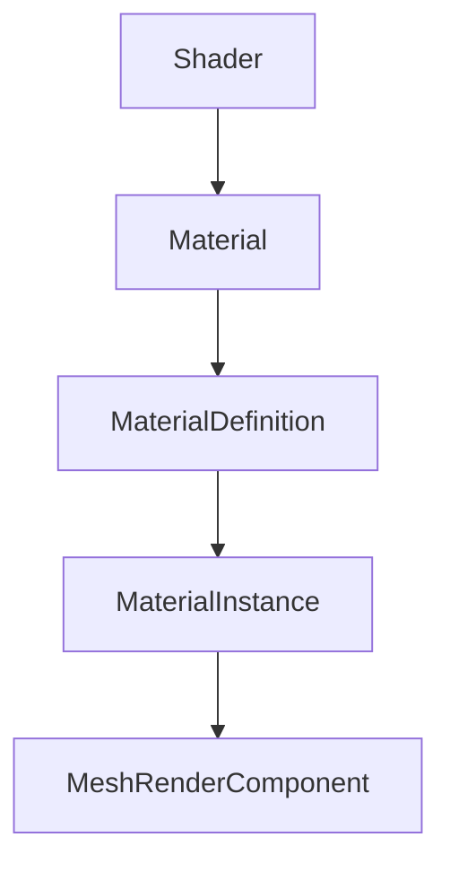

# Materials

MonsterEngine features a PBR (Physically Based Rendering) material system with multiple levels of abstraction.

---

## Material Hierarchy



---

## Quick Start

### Simple Material

```cpp
// Create basic material with shader
auto material = std::make_shared<se::Material>();
material->SetShader(pbrShader);

// Use on mesh
mesh.material = material;
```

### PBR Properties

```cpp
// Direct PBR values on component
mesh.UseCustomPBR = true;
mesh.Metallic = 0.0f;    // 0 = dielectric, 1 = metal
mesh.Roughness = 0.5f;   // 0 = smooth, 1 = rough
mesh.Reflectance = 0.5f; // F0 for dielectrics
mesh.AO = 1.0f;          // Ambient occlusion
```

---

## MaterialDefinition

Templates for materials:

```cpp
se::MaterialDefinition def;
def.name = "Gold";
def.shaderPath = "assets/shaders/pbr";

// Properties
def.SetFloat("metallic", 1.0f);
def.SetFloat("roughness", 0.3f);
def.SetVec3("baseColor", {1.0f, 0.84f, 0.0f});

// Textures
def.AddTexture("albedo", "assets/textures/gold_albedo.png");
def.AddTexture("normal", "assets/textures/gold_normal.png");
def.AddTexture("roughness", "assets/textures/gold_roughness.png");
```

---

## MaterialInstance

Instances from definitions:

```cpp
auto* library = se::MaterialLibrary::Get();

// Register definition
library->RegisterDefinition(goldDef);

// Create instance
auto* goldMaterial = library->CreateInstance("Gold");

// Override properties per-instance
goldMaterial->SetFloat("roughness", 0.5f);

// Use on mesh
mesh.materialInstance = goldMaterial;
```

---

## PBR Textures

Standard PBR texture channels:

| Texture | Description |
|---------|-------------|
| Albedo | Base color (sRGB) |
| Normal | Tangent-space normals |
| Metallic | Metalness (linear, grayscale) |
| Roughness | Roughness (linear, grayscale) |
| AO | Ambient occlusion |
| Emissive | Emission color |

---

## Emissive Materials

Make objects glow:

```cpp
mesh.EmissiveColor = {1.0f, 0.5f, 0.0f};  // Orange
mesh.EmissiveFactor = 5.0f;  // Bright!
```

---

## See Also

- [SceneRenderer](SceneRenderer.md)
- [MaterialLibrary](../resources/MaterialLibrary.md)
- [Renderer Overview](Overview.md)
