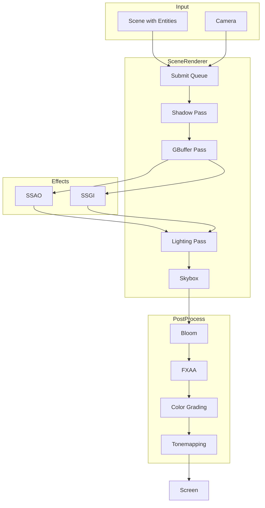

# Renderer Overview

MonsterEngine features a modern PBR (Physically Based Rendering) pipeline built on OpenGL 4.5. This document provides an overview of the rendering architecture.

---

## Architecture



---

## Core Components

### SceneRenderer

The main rendering orchestrator. Handles:
- Shadow map generation (Cascaded Shadow Maps)
- GBuffer pass for deferred data
- PBR lighting with IBL
- Post-processing pipeline

See [SceneRenderer Documentation](SceneRenderer.md)

### Material System

Three-tier material system:
1. **Material**: Low-level shader wrapper
2. **MaterialDefinition**: Template defining properties
3. **MaterialInstance**: Instance with specific values

See [Materials Documentation](Materials.md)

### Post-Processing

Modular post-processing pipeline with:
- Bloom (HDR highlights)
- SSAO (Ambient Occlusion)
- SSGI (Global Illumination)
- FXAA (Anti-aliasing)
- Color Grading
- Tonemapping (ACES, Reinhard, etc.)

See [Post-Processing Overview](../postprocess/Overview.md)

---

## Render Flow per Frame

```mermaid
sequenceDiagram
    participant Layer
    participant SR as SceneRenderer
    participant RS as RenderSystem
    
    Layer->>SR: BeginFrame()
    Note right of SR: Bind HDR framebuffer
    
    Layer->>Scene: OnRender()
    Scene->>RS: RenderScene(registry)
    
    RS->>SR: Submit(mesh, material, transform)
    Note right of SR: Queue for rendering
    
    RS->>SR: EndScene()
    
    rect rgb(50, 50, 70)
        Note right of SR: Shadow Pass (CSM)
        SR->>SR: For each cascade
        SR->>SR: Render shadow casters
    end
    
    rect rgb(50, 70, 50)
        Note right of SR: Main Pass
        SR->>SR: Set camera matrices
        SR->>SR: Bind IBL textures
        SR->>SR: Render all submissions
        SR->>SR: Render instanced batches
        SR->>SR: Render skinned models
        SR->>SR: Render skybox
    end
    
    rect rgb(70, 50, 50)
        Note right of SR: Post-Processing
        SR->>SR: Execute post-process pipeline
    end
    
    Layer->>SR: EndFrame()
    Note right of SR: Blit to screen
```



---

## Key Features

### Physically Based Rendering

- Metallic-roughness workflow
- Image-based lighting (IBL)
- DFG LUT for split-sum approximation
- Energy conservation

### Shadows

- 4-cascade shadow mapping
- Configurable split scheme (logarithmic/uniform blend)
- PCF soft shadows
- Stable shadow edges

### Global Illumination

- Screen-space global illumination (SSGI)
- Spherical harmonics encoding
- Bilateral denoising

### Culling

- Frustum culling
- GPU occlusion culling (optional)
- Instance batching

---

## Coordinate System

MonsterEngine uses a **right-handed coordinate system**:
- **+X**: Right
- **+Y**: Up
- **-Z**: Forward (into screen)

This matches OpenGL conventions.

---

## HDR Rendering

The renderer uses HDR (High Dynamic Range) throughout:

1. Scene is rendered to floating-point framebuffer (RGB16F)
2. Post-processing operates in HDR
3. Tonemapping converts to LDR for display
4. Gamma correction applied at end

Control exposure:
```cpp
sceneRenderer.SetExposure(1.0f);
```

---

## Debug Modes

The renderer supports debug visualization:

```cpp
// Set debug mode
sceneRenderer.SetDebugMode(mode);

// Available modes:
// 0 = Off (normal rendering)
// 1 = Ambient Occlusion
// 2 = Normals
// 3 = Roughness
// 4 = Metallic
```

Cascade visualization for shadows:
```cpp
sceneRenderer.SetVisualizeCascades(true);
```

---

## Render Statistics

Track rendering performance:

```cpp
se::RenderStats stats = sceneRenderer.GetStats();

std::cout << "Draw calls: " << stats.DrawCalls << std::endl;
std::cout << "Triangles: " << stats.TriangleCount << std::endl;
std::cout << "Visible objects: " << stats.VisibleObjects << std::endl;
std::cout << "Frustum culled: " << stats.FrustumCulled << std::endl;
std::cout << "Instanced batches: " << stats.InstancedBatches << std::endl;
```

---

## Configuration

### Culling

```cpp
sceneRenderer.SetFrustumCullingEnabled(true);
// Occlusion culling requires initialization
```

### Shadows

```cpp
sceneRenderer.SetCSMEnabled(true);
sceneRenderer.GetCascadedShadowMap().SetSplitLambda(0.85f);
```

### IBL

```cpp
// Load environment map
sceneRenderer.GetIBLProcessor()->Process("environment.hdr");
```

---

## System Requirements

- OpenGL 4.5 Core
- GL_ARB_compute_shader (for SSGI)
- GL_ARB_shader_storage_buffer_object
- 4GB+ GPU memory recommended

---

## Documentation Index

| Topic | Description |
|-------|-------------|
| [SceneRenderer](SceneRenderer.md) | Main renderer class |
| [Materials](Materials.md) | Material system |
| [Shadows](Shadows.md) | Cascaded Shadow Maps |
| [IBL](IBL.md) | Image-Based Lighting |
| [Culling](Culling.md) | Frustum and occlusion culling |
| [Instancing](Instancing.md) | GPU instanced rendering |
| [Post-Processing](../postprocess/Overview.md) | Post-process pipeline |
