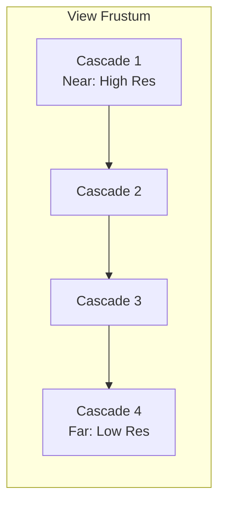

# Shadows (Cascaded Shadow Maps)

MonsterEngine uses Cascaded Shadow Maps (CSM) for high-quality directional light shadows.

---

## Overview

CSM divides the view frustum into multiple cascades, each with its own shadow map. Near objects get high-resolution shadows, far objects get lower resolution.



---

## Configuration

```cpp
auto& renderer = se::Application::Get().GetRenderer().GetSceneRenderer();

// Enable/disable shadows
renderer.SetCSMEnabled(true);

// Access CSM
auto& csm = renderer.GetCascadedShadowMap();

// Resolution (per cascade)
csm.Init(2048);  // 2048x2048 per cascade

// Split scheme (0 = uniform, 1 = logarithmic)
csm.SetSplitLambda(0.85f);
```

---

## Properties

| Property | Type | Default | Description |
|----------|------|---------|-------------|
| Resolution | `int` | 2048 | Shadow map size |
| Split Lambda | `float` | 0.85 | Split distribution |
| Cascade Count | `int` | 4 | Number of cascades (fixed) |

---

## Split Lambda

Controls how cascades are distributed:

- `0.0` = Uniform splits (equal distance)
- `1.0` = Logarithmic splits (more detail near camera)
- `0.85` = Recommended blend

---

## Debug Visualization

```cpp
renderer.SetVisualizeCascades(true);

// Each cascade rendered with different color:
// Cascade 0: Red
// Cascade 1: Green
// Cascade 2: Blue
// Cascade 3: Yellow
```

---

## See Also

- [SceneRenderer](SceneRenderer.md)
- [Renderer Overview](Overview.md)
