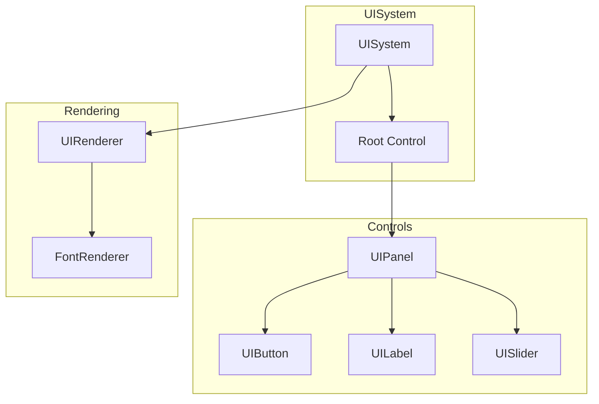

# UI System Overview

MonsterEngine includes a retained-mode UI framework inspired by Godot's Control system. It provides anchor-based positioning, theming, and a variety of built-in widgets.

---

## Architecture



---

## Quick Start

### Create UI Elements

```cpp
#include "engine/ui/native/UIControl.h"
#include "engine/ui/native/widgets/UIButton.h"
#include "engine/ui/native/widgets/UILabel.h"

// Create root
auto root = std::make_unique<se::ui::UIControl>();
root->SetSize(800, 600);

// Add a panel
auto panel = std::make_unique<se::ui::UIPanel>();
panel->SetPosition(100, 100);
panel->SetSize(200, 150);

// Add a button
auto button = std::make_unique<se::ui::UIButton>();
button->SetText("Click Me");
button->SetPosition(20, 20);
button->SetSize(160, 40);
button->SetOnClick([]() {
    Logger::Info("Button clicked!");
});

panel->AddChild(std::move(button));
root->AddChild(std::move(panel));
```

### Render UI

```cpp
void OnRender() {
    se::ui::Render(root.get());
}
```

---

## Key Classes

| Class | Description |
|-------|-------------|
| [UIControl](UIControl.md) | Base class for all UI elements |
| [Widgets](Widgets.md) | Button, Label, Slider, etc. |
| [Containers](Containers.md) | Layout containers |
| [Theming](Theming.md) | Visual theming system |
| [HUD](HUD.md) | HUD controller |

---

## Anchor System

Controls can be anchored relative to their parent:

```cpp
// Full screen stretch
control->SetAnchorsPreset(se::ui::LayoutPreset::FullRect);

// Center of parent
control->SetAnchorsPreset(se::ui::LayoutPreset::Center);

// Bottom-right corner
control->SetAnchorsPreset(se::ui::LayoutPreset::BottomRight);
```

### Anchor Presets

| Preset | Description |
|--------|-------------|
| `TopLeft` | Top-left corner |
| `TopRight` | Top-right corner |
| `BottomLeft` | Bottom-left corner |
| `BottomRight` | Bottom-right corner |
| `CenterLeft` | Left edge, vertically centered |
| `CenterRight` | Right edge, vertically centered |
| `CenterTop` | Top edge, horizontally centered |
| `CenterBottom` | Bottom edge, horizontally centered |
| `Center` | Centered in parent |
| `LeftWide` | Full left edge |
| `TopWide` | Full top edge |
| `RightWide` | Full right edge |
| `BottomWide` | Full bottom edge |
| `FullRect` | Fill entire parent |

---

## Input Handling

Controls receive input events based on their `MouseFilter`:

```cpp
control->SetMouseFilter(se::ui::MouseFilter::Stop);    // Receive events, stop propagation
control->SetMouseFilter(se::ui::MouseFilter::Pass);    // Receive events, pass to children
control->SetMouseFilter(se::ui::MouseFilter::Ignore);  // Ignore input
```

---

## Built-in Widgets

- **UIButton**: Clickable button with text
- **UILabel**: Text display
- **UISlider**: Value slider
- **UICheckBox**: Toggle checkbox
- **UIProgressBar**: Progress display
- **UITextureRect**: Image display
- **UIPanel**: Container panel

---

## Example: Game HUD

```cpp
class GameHUD {
public:
    void Initialize() {
        root_ = std::make_unique<se::ui::UIControl>();
        
        // Health bar (top-left)
        healthBar_ = CreateProgressBar(10, 10, 200, 20);
        healthBar_->SetValue(1.0f);
        root_->AddChild(std::move(healthBar_));
        
        // Score label (top-right)
        scoreLabel_ = CreateLabel(0, 10, "Score: 0");
        scoreLabel_->SetAnchorsPreset(se::ui::LayoutPreset::TopRight);
        root_->AddChild(std::move(scoreLabel_));
    }
    
    void UpdateHealth(float percent) {
        healthBar_->SetValue(percent);
    }
    
    void UpdateScore(int score) {
        scoreLabel_->SetText("Score: " + std::to_string(score));
    }
    
    void Render() {
        se::ui::Render(root_.get());
    }
    
private:
    std::unique_ptr<se::ui::UIControl> root_;
    se::ui::UIProgressBar* healthBar_;
    se::ui::UILabel* scoreLabel_;
};
```

---

## See Also

- [UIControl](UIControl.md)
- [Widgets](Widgets.md)
- [Containers](Containers.md)
- [Theming](Theming.md)
