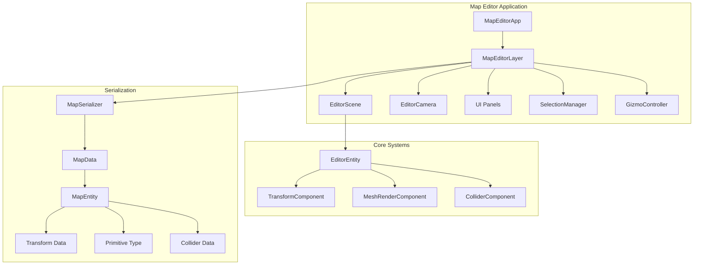

# Map Editor System - Implementation Plan

Create a standalone map editor application inspired by Valve's Hammer, allowing creation of game levels with primitives, collision data, and export to `.mstmap` format.

---

## User Review Required

> [!IMPORTANT]
> **Standalone Application**: The map editor will be a separate executable (`map_editor`) in `apps/map_editor/`, following the same pattern as `third_person_game`.

> [!IMPORTANT]
> **File Format Scope**: This implementation covers **export only**. The engine-side loader will be implemented separately as requested.

> [!CAUTION]
> **ImGuizmo Integration**: ImGuizmo requires a working camera system. The editor will have its own orbit camera, separate from the game camera system.

---

## Architecture Overview



---

## Proposed Changes

### Core Data Structures

#### [NEW] [MapData.h](file:///c:/Users/rapha/_PROJECTS/SimpleEngine/engine/include/engine/editor/MapData.h)

Define serializable map format:

```cpp
namespace se::editor {

enum class PrimitiveType : uint8_t {
    Cube, Sphere, Capsule, Cylinder, Plane
};

enum class ColliderType : uint8_t {
    None, Box, Sphere, Capsule
};

struct MapEntityData {
    std::string     name;
    PrimitiveType   primitiveType;
    Vector3         position;
    Vector3         rotation;  // Euler degrees
    Vector3         scale;
    Vector4         color;
    
    // Optional collision
    bool            hasCollision = false;
    ColliderType    colliderType = ColliderType::None;
    Vector3         colliderSize;    // Box size or Capsule dimensions
    float           colliderRadius;  // Sphere/Capsule radius
};

struct MapData {
    static constexpr uint32_t MAGIC = 0x4D53544D; // "MSTM"
    static constexpr uint32_t VERSION = 1;
    
    std::string                 mapName;
    std::vector<MapEntityData>  entities;
};

}
```

---

#### [NEW] [MapSerializer.h](file:///c:/Users/rapha/_PROJECTS/SimpleEngine/engine/include/engine/editor/MapSerializer.h)

Handle `.mstmap` file export:

```cpp
namespace se::editor {

class MapSerializer {
public:
    static bool Export(const MapData& data, const std::filesystem::path& path);
    // Load will be added later for engine integration
    
private:
    static void WriteHeader(std::ofstream& file, const MapData& data);
    static void WriteEntity(std::ofstream& file, const MapEntityData& entity);
};

}
```

---

### Editor Application

#### [NEW] [map_editor/](file:///c:/Users/rapha/_PROJECTS/SimpleEngine/apps/map_editor/)

New application directory structure:
```
apps/map_editor/
├── CMakeLists.txt
└── src/
    ├── main.cpp
    ├── MapEditorLayer.h
    ├── MapEditorLayer.cpp
    ├── EditorCamera.h
    ├── EditorCamera.cpp
    ├── SelectionManager.h
    ├── SelectionManager.cpp
    ├── GizmoController.h
    ├── GizmoController.cpp
    └── ui/
        ├── MainMenuBar.h
        ├── MainMenuBar.cpp
        ├── HierarchyPanel.h
        ├── HierarchyPanel.cpp
        ├── PropertiesPanel.h
        └── PropertiesPanel.cpp
```

---

#### [NEW] [MapEditorLayer.h](file:///c:/Users/rapha/_PROJECTS/SimpleEngine/apps/map_editor/src/MapEditorLayer.h)

Main editor layer coordinating all systems:

```cpp
class MapEditorLayer : public se::Layer {
public:
    void OnAttach() override;
    void OnDetach() override;
    void OnUpdate(float ts) override;
    void OnRender() override;
    void OnImGuiRender() override;
    
private:
    // Scene management
    std::unique_ptr<se::Scene> scene_;
    EditorCamera editorCamera_;
    
    // Selection & manipulation
    SelectionManager selection_;
    GizmoController gizmo_;
    
    // UI panels
    MainMenuBar menuBar_;
    HierarchyPanel hierarchy_;
    PropertiesPanel properties_;
    
    // Map data for export
    MapData currentMap_;
    std::string currentFilePath_;
    
    // Operations
    void CreatePrimitive(PrimitiveType type);
    void DuplicateSelected();
    void DeleteSelected();
    void ExportMap();
    void ShowExportDialog();
};
```

---

#### [NEW] [EditorCamera.h](file:///c:/Users/rapha/_PROJECTS/SimpleEngine/apps/map_editor/src/EditorCamera.h)

Orbit camera for editor navigation:

```cpp
class EditorCamera {
public:
    void Update(float deltaTime);
    void OnMouseMove(float dx, float dy);
    void OnMouseScroll(float delta);
    
    Camera& GetCamera() { return camera_; }
    
    void FocusOnPoint(const Vector3& point);
    void SetOrbitDistance(float distance);
    
private:
    Camera camera_;
    Vector3 focusPoint_{0.0f};
    float orbitDistance_ = 10.0f;
    float yaw_ = 0.0f;
    float pitch_ = -30.0f;
    bool isPanning_ = false;
    bool isOrbiting_ = false;
};
```

---

#### [NEW] [SelectionManager.h](file:///c:/Users/rapha/_PROJECTS/SimpleEngine/apps/map_editor/src/SelectionManager.h)

Handle entity selection:

```cpp
class SelectionManager {
public:
    void Select(se::Entity entity);
    void AddToSelection(se::Entity entity);
    void ClearSelection();
    void ToggleSelection(se::Entity entity);
    
    bool IsSelected(se::Entity entity) const;
    bool HasSelection() const;
    
    se::Entity GetPrimarySelection() const;
    const std::vector<se::Entity>& GetSelectedEntities() const;
    
private:
    std::vector<se::Entity> selectedEntities_;
};
```

---

#### [NEW] [GizmoController.h](file:///c:/Users/rapha/_PROJECTS/SimpleEngine/apps/map_editor/src/GizmoController.h)

ImGuizmo integration:

```cpp
class GizmoController {
public:
    enum class Operation { Translate, Rotate, Scale };
    enum class Space { Local, World };
    
    void SetOperation(Operation op);
    void SetSpace(Space space);
    void ToggleSpace();
    
    // Returns true if gizmo was manipulated
    bool Manipulate(const Camera& camera, se::TransformComponent& transform);
    
    Operation GetOperation() const { return operation_; }
    Space GetSpace() const { return space_; }
    
private:
    Operation operation_ = Operation::Translate;
    Space space_ = Space::World;
};
```

---

### UI Components

#### [NEW] [MainMenuBar.h](file:///c:/Users/rapha/_PROJECTS/SimpleEngine/apps/map_editor/src/ui/MainMenuBar.h)

```cpp
class MainMenuBar {
public:
    struct Actions {
        bool newMap = false;
        bool exportMap = false;
        
        bool createCube = false;
        bool createSphere = false;
        bool createCapsule = false;
        bool createCylinder = false;
        bool createPlane = false;
        
        bool deleteSelected = false;
        bool duplicateSelected = false;
        
        bool toggleGrid = false;
    };
    
    Actions Render();
};
```

---

#### [NEW] [HierarchyPanel.h](file:///c:/Users/rapha/_PROJECTS/SimpleEngine/apps/map_editor/src/ui/HierarchyPanel.h)

Entity list with selection:

```cpp
class HierarchyPanel {
public:
    void Render(se::Scene& scene, SelectionManager& selection);
    
    // Context menu actions
    bool WantsDelete() const { return wantsDelete_; }
    bool WantsDuplicate() const { return wantsDuplicate_; }
    void ClearActions();
    
private:
    bool wantsDelete_ = false;
    bool wantsDuplicate_ = false;
    
    void RenderEntityNode(se::Entity entity, SelectionManager& selection);
    void RenderContextMenu(se::Entity entity);
};
```

---

#### [NEW] [PropertiesPanel.h](file:///c:/Users/rapha/_PROJECTS/SimpleEngine/apps/map_editor/src/ui/PropertiesPanel.h)

Inspector for selected entity:

```cpp
class PropertiesPanel {
public:
    void Render(SelectionManager& selection);
    
private:
    void RenderTransform(se::TransformComponent& transform);
    void RenderMeshRenderer(se::MeshRenderComponent& mesh);
    void RenderCollider(se::Entity entity);
    void RenderColliderTypeSelector(se::Entity entity);
};
```

---

### Build System

#### [NEW] [CMakeLists.txt](file:///c:/Users/rapha/_PROJECTS/SimpleEngine/apps/map_editor/CMakeLists.txt)

```cmake
cmake_minimum_required(VERSION 3.5)

file(GLOB_RECURSE SOURCES "${CMAKE_CURRENT_SOURCE_DIR}/src/*.cpp")

add_executable(map_editor ${SOURCES})

target_include_directories(map_editor PUBLIC
    ${CMAKE_CURRENT_SOURCE_DIR}/src
)

target_link_libraries(map_editor
    simple_engine
    ImGui
)

# Copy assets
set(ASSETS_SOURCE_DIR "${CMAKE_SOURCE_DIR}/assets")
if(EXISTS "${ASSETS_SOURCE_DIR}")
    add_custom_command(TARGET map_editor POST_BUILD
        COMMAND ${CMAKE_COMMAND} -E copy_directory
        "${ASSETS_SOURCE_DIR}" "$<TARGET_FILE_DIR:map_editor>/assets"
    )
endif()
```

---

#### [MODIFY] [CMakeLists.txt](file:///c:/Users/rapha/_PROJECTS/SimpleEngine/CMakeLists.txt)

Add map_editor to build:

```diff
 add_subdirectory(apps/third_person_game)
+add_subdirectory(apps/map_editor)
```

---

### Engine Additions

#### [NEW] [engine/include/engine/editor/](file:///c:/Users/rapha/_PROJECTS/SimpleEngine/engine/include/engine/editor/)

New directory for editor-related engine code:
- `MapData.h` - Data structures
- `MapSerializer.h` - Serialization interface
- `PrimitiveFactory.h` - Create primitives with meshes

---

#### [MODIFY] [engine/CMakeLists.txt](file:///c:/Users/rapha/_PROJECTS/SimpleEngine/engine/CMakeLists.txt)

Add ImGuizmo to engine build:

```diff
+# ImGuizmo
+target_include_directories(simple_engine PUBLIC
+    ${CMAKE_CURRENT_SOURCE_DIR}/third_party/ImGuizmo
+)
+target_sources(simple_engine PRIVATE
+    ${CMAKE_CURRENT_SOURCE_DIR}/third_party/ImGuizmo/ImGuizmo.cpp
+)
```

---

## .mstmap File Format

Binary format with header and entity list:

```
Header (16 bytes):
  - Magic: 4 bytes (0x4D53544D = "MSTM")
  - Version: 4 bytes (uint32)
  - EntityCount: 4 bytes (uint32)
  - Reserved: 4 bytes

MapName:
  - NameLength: 4 bytes (uint32)
  - NameData: variable (UTF-8)

For each Entity:
  - NameLength: 4 bytes
  - NameData: variable
  - PrimitiveType: 1 byte (enum)
  - Position: 12 bytes (3x float)
  - Rotation: 12 bytes (3x float)
  - Scale: 12 bytes (3x float)
  - Color: 16 bytes (4x float)
  - HasCollision: 1 byte (bool)
  - [If HasCollision]:
    - ColliderType: 1 byte (enum)
    - ColliderData: variable (type-dependent)
```

---

## Verification Plan

### Build Verification
Run the build script to verify compilation:
```batch
cd c:\Users\rapha\_PROJECTS\SimpleEngine
scripts\generate_visual_studio_files_and_build.bat
```

Expected: Build succeeds with `map_editor.exe` created.

### Manual Testing

1. **Launch Editor**
   - Run `map_editor.exe`
   - Verify ImGui window opens with menu bar and panels

2. **Create Primitives**
   - Use `Create > Cube` menu
   - Verify cube appears in viewport and hierarchy

3. **Gizmo Manipulation**
   - Select entity
   - Press `W` for translate, `E` for rotate, `R` for scale
   - Drag gizmo handles
   - Verify transform updates in properties panel

4. **Right-Click Context Menu**
   - Right-click on entity in hierarchy
   - Verify "Delete" and "Duplicate" options appear
   - Test both operations

5. **Collider Properties**
   - Select entity
   - In properties, enable "Has Collision"
   - Choose collider type
   - Verify collider parameters appear

6. **Export Map**
   - `File > Export Map...`
   - Choose filename and location
   - Verify `.mstmap` file is created

7. **Cross-Platform Check**
   - Build on Linux using `scripts/run.sh` equivalent
   - Verify same functionality

---

## Future Enhancements (Out of Scope)

- Engine-side `.mstmap` loader
- Undo/redo system
- Multi-selection box select
- Grid snapping
- Copy/paste between maps
- Custom mesh import
